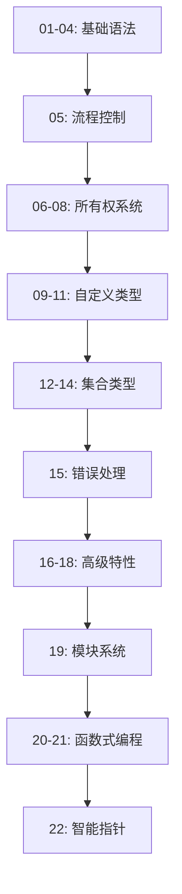

# Rust 语法学习指南设计文档

## 一、设计目标

创建一套系统化的Rust学习示例文件,帮助学习者通过实践代码深入理解Rust语言的核心概念和语法特性。每个示例文件专注于一个主题,包含详细的说明和可执行的示例代码。

## 二、设计范围

### 覆盖的核心主题

| 序号 | 主题 | 核心知识点 |
|------|------|-----------|
| 01 | 变量与可变性 | 变量声明、可变性、常量、隐藏(shadowing) |
| 02 | 数据类型 | 标量类型(整数、浮点、布尔、字符)、复合类型(元组、数组) |
| 03 | 函数 | 函数定义、参数、返回值、语句与表达式 |
| 04 | 注释 | 行注释、文档注释 |
| 05 | 流程控制 | if表达式、循环(loop、while、for)、模式匹配基础 |
| 06 | 所有权系统 | 所有权规则、移动、克隆、栈与堆 |
| 07 | 引用与借用 | 不可变引用、可变引用、借用规则、悬垂引用 |
| 08 | 切片类型 | 字符串切片、数组切片、切片的应用 |
| 09 | 结构体 | 结构体定义、实例化、方法、关联函数 |
| 10 | 枚举 | 枚举定义、枚举值、Option枚举 |
| 11 | 模式匹配 | match表达式、if let、模式解构 |
| 12 | Vector集合 | 创建、读取、更新、遍历、存储不同类型 |
| 13 | String字符串 | 创建、更新、拼接、索引、遍历、切片 |
| 14 | HashMap集合 | 创建、访问、更新、遍历、所有权 |
| 15 | 错误处理 | panic!宏、Result类型、?操作符、自定义错误 |
| 16 | 泛型 | 泛型函数、泛型结构体、泛型枚举、泛型方法 |
| 17 | Trait特征 | Trait定义、实现、Trait约束、默认实现、Trait对象 |
| 18 | 生命周期 | 生命周期标注、函数中的生命周期、结构体中的生命周期 |
| 19 | 包和模块 | 包(package)、crate、模块(module)、路径、use关键字、pub可见性 |
| 20 | 迭代器 | Iterator trait、迭代器适配器、消费器、自定义迭代器 |
| 21 | 闭包 | 闭包语法、类型推断、捕获环境、Fn trait |
| 22 | 智能指针 | Box、Rc、RefCell、Deref、Drop |

## 三、文件组织结构

### 目录结构设计

```
learn_rust/
├── src/
│   ├── main.rs                    # 主入口文件,提供学习导航
│   ├── example_01_variables.rs    # 变量与可变性示例
│   ├── example_02_data_types.rs   # 数据类型示例
│   ├── example_03_functions.rs    # 函数示例
│   ├── example_04_comments.rs     # 注释示例
│   ├── example_05_control_flow.rs # 流程控制示例
│   ├── example_06_ownership.rs    # 所有权示例
│   ├── example_07_references.rs   # 引用与借用示例
│   ├── example_08_slices.rs       # 切片示例
│   ├── example_09_structs.rs      # 结构体示例
│   ├── example_10_enums.rs        # 枚举示例
│   ├── example_11_match.rs        # 模式匹配示例
│   ├── example_12_vector.rs       # Vector集合示例
│   ├── example_13_string.rs       # String字符串示例
│   ├── example_14_hashmap.rs      # HashMap示例
│   ├── example_15_error_handling.rs # 错误处理示例
│   ├── example_16_generics.rs     # 泛型示例
│   ├── example_17_traits.rs       # Trait示例
│   ├── example_18_lifetimes.rs    # 生命周期示例
│   ├── example_19_modules.rs      # 包和模块示例
│   ├── example_20_iterators.rs    # 迭代器示例
│   ├── example_21_closures.rs     # 闭包示例
│   └── example_22_smart_pointers.rs # 智能指针示例
├── Cargo.toml
└── Cargo.lock
```

### 文件命名规范

- 使用前缀 `example_` 标识示例文件
- 使用两位数序号(01-22)便于排序和快速定位
- 使用下划线分隔的小写字母描述主题
- 扩展名统一为 `.rs`

## 四、单个示例文件的内容结构

### 标准化内容模板

每个示例文件应包含以下结构化内容:

| 部分 | 说明 | 必需性 |
|------|------|--------|
| 文件头注释 | 说明文件主题、学习目标 | 必需 |
| 概念说明区 | 用注释形式解释核心概念 | 必需 |
| 基础示例 | 最简单的用法演示 | 必需 |
| 进阶示例 | 较复杂的实际应用场景 | 推荐 |
| 常见陷阱说明 | 容易出错的地方和最佳实践 | 推荐 |
| 练习函数 | 供学习者实践的函数框架 | 可选 |
| 主函数 | 调用各个示例的入口点 | 必需 |

### 内容组织原则

1. **渐进式学习**: 从简单到复杂,每个概念先介绍基础用法,再展示进阶技巧
2. **可运行性**: 每个文件都应该能够独立编译和运行
3. **注释充分**: 关键代码行都应有解释性注释
4. **实用性**: 示例应贴近实际使用场景,避免纯理论示例
5. **独立性**: 文件间尽量保持独立,减少相互依赖

## 五、主入口文件设计

### main.rs 的职责

主入口文件应提供以下功能:

1. **学习导航**: 列出所有示例模块及其学习顺序
2. **模块选择机制**: 允许运行特定的示例模块
3. **使用说明**: 指导学习者如何使用这套学习资源

### 模块调用策略

由于每个示例文件都有自己的主函数,需要通过模块化方式组织:

**方案**: 将每个示例封装为模块,提供统一的运行接口

- 每个示例文件提供一个公开函数(如 `run()`)作为入口
- main.rs 通过条件编译或命令行参数选择要运行的示例
- 提供交互式菜单让学习者选择要学习的主题

## 六、各主题详细设计

### 6.1 变量与可变性 (example_01_variables.rs)

**学习目标**:
- 理解Rust默认不可变的设计理念
- 掌握 let 和 mut 关键字的使用
- 理解常量 const 的使用场景
- 掌握变量隐藏(shadowing)机制

**核心示例内容**:

| 示例类型 | 演示内容 |
|---------|---------|
| 不可变变量 | 声明变量后不能修改的特性 |
| 可变变量 | 使用 mut 关键字声明可变变量 |
| 常量 | const 声明常量,命名规范,类型必须标注 |
| 变量隐藏 | 同名变量重新声明,类型可改变 |
| 作用域 | 块级作用域中的变量隐藏 |

### 6.2 数据类型 (example_02_data_types.rs)

**学习目标**:
- 掌握Rust的标量类型
- 掌握复合类型
- 理解类型推断和显式类型标注

**核心示例内容**:

| 类型分类 | 具体类型 | 演示内容 |
|---------|---------|---------|
| 整数类型 | i8, i16, i32, i64, i128, isize<br>u8, u16, u32, u64, u128, usize | 不同大小整数,有符号无符号,字面量表示法 |
| 浮点类型 | f32, f64 | 浮点数运算,精度问题 |
| 布尔类型 | bool | true/false,逻辑运算 |
| 字符类型 | char | Unicode字符,单引号表示 |
| 元组类型 | (T1, T2, ...) | 创建、访问、解构 |
| 数组类型 | [T; N] | 固定长度数组,访问、遍历 |

### 6.3 函数 (example_03_functions.rs)

**学习目标**:
- 掌握函数定义和调用语法
- 理解参数和返回值
- 理解语句和表达式的区别
- 掌握提前返回

**核心示例内容**:

| 示例类型 | 演示内容 |
|---------|---------|
| 基础函数 | 无参数无返回值函数 |
| 参数传递 | 单参数、多参数函数 |
| 返回值 | 使用箭头语法声明返回类型 |
| 表达式返回 | 最后一个表达式作为返回值(不加分号) |
| 提前返回 | 使用 return 关键字 |
| 语句vs表达式 | 演示两者的区别 |

### 6.4 注释 (example_04_comments.rs)

**学习目标**:
- 掌握行注释和块注释
- 了解文档注释的写法

**核心示例内容**:

| 注释类型 | 语法 | 用途 |
|---------|------|------|
| 行注释 | // | 单行说明 |
| 文档注释 | /// 或 //! | 生成文档,支持Markdown |

### 6.5 流程控制 (example_05_control_flow.rs)

**学习目标**:
- 掌握 if 表达式的使用
- 掌握三种循环结构
- 理解循环标签和跳出机制
- 理解 if 作为表达式的特性

**核心示例内容**:

| 控制结构 | 演示内容 |
|---------|---------|
| if 表达式 | 条件判断,else if,else分支 |
| if 赋值 | if 作为表达式为变量赋值 |
| loop 循环 | 无限循环,break 跳出,返回值 |
| while 循环 | 条件循环 |
| for 循环 | 遍历集合,使用 range |
| 循环标签 | 嵌套循环中使用标签跳出 |

### 6.6 所有权系统 (example_06_ownership.rs)

**学习目标**:
- 理解所有权的三条规则
- 理解移动(move)语义
- 理解克隆(clone)
- 理解栈和堆的区别

**核心示例内容**:

| 概念 | 演示内容 |
|------|---------|
| 所有权规则 | 每个值有唯一所有者,离开作用域自动释放 |
| 移动语义 | 赋值和传参导致所有权转移 |
| 克隆 | 使用 clone() 深拷贝 |
| Copy trait | 栈上数据的隐式拷贝 |
| 函数与所有权 | 传参和返回值的所有权转移 |

### 6.7 引用与借用 (example_07_references.rs)

**学习目标**:
- 掌握引用的创建和使用
- 理解借用规则
- 避免悬垂引用

**核心示例内容**:

| 概念 | 演示内容 |
|------|---------|
| 不可变引用 | 使用 & 创建引用,允许多个不可变引用 |
| 可变引用 | 使用 &mut 创建,同一时间只能有一个 |
| 借用规则 | 不可变和可变引用不能同时存在 |
| 引用作用域 | NLL(非词法作用域生命周期) |
| 悬垂引用 | 编译器防止悬垂引用 |

### 6.8 切片类型 (example_08_slices.rs)

**学习目标**:
- 掌握切片的概念和语法
- 理解字符串切片
- 掌握数组切片

**核心示例内容**:

| 切片类型 | 演示内容 |
|---------|---------|
| 字符串切片 | &str 类型,字符串的部分引用 |
| 切片语法 | [start..end], [..end], [start..], [..] |
| 数组切片 | 对数组的切片操作 |
| 切片应用 | 查找单词,字符串解析等实用场景 |

### 6.9 结构体 (example_09_structs.rs)

**学习目标**:
- 掌握结构体的定义和实例化
- 掌握方法和关联函数
- 了解元组结构体和单元结构体

**核心示例内容**:

| 概念 | 演示内容 |
|------|---------|
| 结构体定义 | 字段名和类型 |
| 实例化 | 创建实例,字段初始化简写,结构体更新语法 |
| 方法 | impl 块,self 参数,方法调用 |
| 关联函数 | 不带 self 的函数,常用于构造器 |
| 元组结构体 | 具名但字段无名的结构体 |
| 单元结构体 | 无字段结构体 |

### 6.10 枚举 (example_10_enums.rs)

**学习目标**:
- 掌握枚举的定义和使用
- 理解枚举变体可以携带数据
- 掌握 Option 枚举的使用

**核心示例内容**:

| 概念 | 演示内容 |
|------|---------|
| 枚举定义 | 定义多个变体 |
| 携带数据 | 变体携带不同类型数据 |
| 枚举方法 | 为枚举实现方法 |
| Option枚举 | Some 和 None,处理空值 |

### 6.11 模式匹配 (example_11_match.rs)

**学习目标**:
- 掌握 match 表达式
- 理解穷尽性检查
- 掌握 if let 语法
- 掌握模式解构

**核心示例内容**:

| 概念 | 演示内容 |
|------|---------|
| match 基础 | 匹配枚举,穷尽所有可能 |
| 绑定值 | 从模式中提取值 |
| 通配符 | _ 和 其他模式 |
| if let | 简化只关心一种模式的场景 |
| 解构 | 解构结构体、枚举、元组 |

### 6.12 Vector集合 (example_12_vector.rs)

**学习目标**:
- 掌握 Vec 的创建和操作
- 理解 Vector 的所有权规则
- 掌握遍历方法

**核心示例内容**:

| 操作 | 演示内容 |
|------|---------|
| 创建 | Vec::new(), vec!宏 |
| 添加元素 | push 方法 |
| 读取元素 | 索引访问和 get 方法 |
| 更新元素 | 可变引用修改 |
| 遍历 | for 循环遍历,不可变和可变遍历 |
| 存储多类型 | 使用枚举存储不同类型 |

### 6.13 String字符串 (example_13_string.rs)

**学习目标**:
- 理解 String 和 &str 的区别
- 掌握字符串的创建和操作
- 理解 UTF-8 编码和索引问题

**核心示例内容**:

| 操作 | 演示内容 |
|------|---------|
| 创建 | String::new(), to_string(), String::from() |
| 更新 | push_str, push, + 运算符, format! 宏 |
| 索引问题 | 为什么不能用索引,内部表示 |
| 遍历 | chars(), bytes() 方法 |
| 切片 | 字节索引切片的注意事项 |

### 6.14 HashMap集合 (example_14_hashmap.rs)

**学习目标**:
- 掌握 HashMap 的创建和操作
- 理解所有权规则
- 掌握更新策略

**核心示例内容**:

| 操作 | 演示内容 |
|------|---------|
| 创建 | HashMap::new(), collect 方法 |
| 插入 | insert 方法 |
| 访问 | get 方法,返回 Option |
| 遍历 | for 循环遍历键值对 |
| 更新 | 覆盖、不存在时插入、基于旧值更新 |
| 所有权 | 键值的所有权转移 |

### 6.15 错误处理 (example_15_error_handling.rs)

**学习目标**:
- 理解可恢复和不可恢复错误
- 掌握 Result 类型的使用
- 掌握 ? 操作符
- 了解自定义错误类型

**核心示例内容**:

| 概念 | 演示内容 |
|------|---------|
| panic! | 不可恢复错误,程序终止 |
| Result枚举 | Ok 和 Err 变体 |
| match处理 | 使用 match 处理 Result |
| unwrap/expect | 快速处理(可能panic) |
| ? 操作符 | 错误传播简写 |
| 自定义错误 | 定义错误类型 |

### 6.16 泛型 (example_16_generics.rs)

**学习目标**:
- 掌握泛型函数的定义
- 掌握泛型结构体和枚举
- 理解泛型方法
- 了解泛型的性能

**核心示例内容**:

| 概念 | 演示内容 |
|------|---------|
| 泛型函数 | 函数参数和返回值使用泛型 |
| 泛型结构体 | 结构体字段使用泛型 |
| 泛型枚举 | Option, Result 等标准库例子 |
| 泛型方法 | impl 块中使用泛型 |
| 多个泛型参数 | 使用多个类型参数 |

### 6.17 Trait特征 (example_17_traits.rs)

**学习目标**:
- 掌握 Trait 的定义和实现
- 理解 Trait 约束
- 掌握默认实现
- 了解 Trait 对象

**核心示例内容**:

| 概念 | 演示内容 |
|------|---------|
| Trait定义 | 定义方法签名 |
| Trait实现 | 为类型实现 Trait |
| 默认实现 | 提供默认方法实现 |
| Trait约束 | 泛型参数的 Trait 约束 |
| 多个约束 | 使用 + 和 where 子句 |
| Trait对象 | dyn 关键字,动态分发 |
| 返回Trait | impl Trait 语法 |

### 6.18 生命周期 (example_18_lifetimes.rs)

**学习目标**:
- 理解生命周期的概念
- 掌握生命周期标注语法
- 理解生命周期省略规则
- 掌握结构体中的生命周期

**核心示例内容**:

| 概念 | 演示内容 |
|------|---------|
| 生命周期问题 | 悬垂引用的场景 |
| 生命周期标注 | 'a 语法,函数签名中的标注 |
| 生命周期约束 | 多个引用参数的关系 |
| 结构体生命周期 | 结构体持有引用 |
| 生命周期省略 | 三条省略规则 |
| 静态生命周期 | 'static 的含义 |

### 6.19 包和模块 (example_19_modules.rs)

**学习目标**:
- 理解包、crate、模块的概念
- 掌握模块定义和使用
- 掌握路径系统
- 理解可见性规则

**核心示例内容**:

| 概念 | 演示内容 |
|------|---------|
| 包和crate | package, binary crate, library crate |
| 模块定义 | mod 关键字,嵌套模块 |
| 路径 | 绝对路径、相对路径、super、self |
| pub 可见性 | 公有和私有,pub 关键字 |
| use 关键字 | 引入路径,as 重命名,嵌套路径 |
| 模块拆分 | 单独文件中的模块 |

### 6.20 迭代器 (example_20_iterators.rs)

**学习目标**:
- 理解 Iterator trait
- 掌握迭代器适配器
- 掌握消费器方法
- 了解自定义迭代器

**核心示例内容**:

| 概念 | 演示内容 |
|------|---------|
| Iterator trait | next 方法 |
| 创建迭代器 | iter(), iter_mut(), into_iter() |
| 适配器 | map, filter, zip, take, skip 等 |
| 消费器 | collect, sum, count, for_each 等 |
| 惰性求值 | 迭代器的惰性特性 |
| 自定义迭代器 | 实现 Iterator trait |

### 6.21 闭包 (example_21_closures.rs)

**学习目标**:
- 掌握闭包语法
- 理解闭包类型推断
- 理解闭包捕获环境的方式
- 了解 Fn trait

**核心示例内容**:

| 概念 | 演示内容 |
|------|---------|
| 闭包语法 | 参数列表和函数体 |
| 类型推断 | 编译器推断参数和返回类型 |
| 捕获环境 | 捕获外部变量 |
| 捕获方式 | 不可变借用、可变借用、获取所有权 |
| Fn traits | Fn, FnMut, FnOnce |
| move 关键字 | 强制获取所有权 |

### 6.22 智能指针 (example_22_smart_pointers.rs)

**学习目标**:
- 理解智能指针的概念
- 掌握 Box 的使用
- 掌握 Rc 引用计数
- 掌握 RefCell 内部可变性
- 理解 Deref 和 Drop trait

**核心示例内容**:

| 智能指针 | 演示内容 |
|---------|---------|
| Box<T> | 堆分配,递归类型,Trait对象 |
| Deref trait | 解引用强制转换 |
| Drop trait | 自定义清理代码 |
| Rc<T> | 引用计数,多所有权 |
| RefCell<T> | 运行时借用检查,内部可变性 |
| 组合使用 | Rc<RefCell<T>> 模式 |

## 七、编译和运行策略

### 单文件独立运行

由于 Rust 项目默认只有一个 main 函数入口,需要采用以下策略之一:

**策略一: 临时修改入口**
- 学习者在 Cargo.toml 中临时修改 `[[bin]]` 配置
- 指定要运行的示例文件作为入口
- 适合深入学习单个主题

**策略二: 模块化封装**
- 每个示例文件导出一个公开的 `run()` 函数
- main.rs 通过命令行参数或交互菜单选择运行
- 适合快速浏览和对比学习

**策略三: 示例(examples)目录**
- 将示例文件移至 `examples/` 目录
- 使用 `cargo run --example example_name` 运行
- 符合 Cargo 项目规范

### 推荐方案

采用 **策略三(examples 目录)** 结合修改后的文件结构:

```
learn_rust/
├── src/
│   └── main.rs                    # 学习指南和导航
├── examples/
│   ├── 01_variables.rs
│   ├── 02_data_types.rs
│   ├── 03_functions.rs
│   ├── ... (其他示例文件)
├── Cargo.toml
└── README.md                      # 学习指南文档
```

运行方式:
```
cargo run --example 01_variables
cargo run --example 02_data_types
...
```

## 八、项目配置

### Cargo.toml 配置调整

需要保持现有配置,无需添加额外依赖。示例文件放在 `examples/` 目录后,Cargo 会自动识别为独立的二进制目标。

### 可选依赖

如果某些高级示例需要,可以考虑添加:

| 依赖库 | 用途 | 使用场景 |
|-------|------|----------|
| rand | 随机数生成 | 某些示例需要随机数 |
| serde | 序列化/反序列化 | JSON等数据格式处理示例 |

## 九、学习路径建议

### 推荐学习顺序



### 分阶段学习

| 阶段 | 主题序号 | 学习目标 | 预计时间 |
|------|---------|---------|----------|
| 第一阶段 | 01-05 | 掌握基础语法和流程控制 | 1-2天 |
| 第二阶段 | 06-08 | 理解所有权系统(重点) | 2-3天 |
| 第三阶段 | 09-14 | 掌握数据结构和集合 | 2-3天 |
| 第四阶段 | 15 | 掌握错误处理 | 1天 |
| 第五阶段 | 16-18 | 掌握泛型、Trait、生命周期 | 3-4天 |
| 第六阶段 | 19 | 理解模块和包管理 | 1-2天 |
| 第七阶段 | 20-22 | 掌握高级特性 | 2-3天 |

## 十、质量标准

### 代码质量要求

| 质量维度 | 要求 |
|---------|------|
| 可编译性 | 所有示例文件必须能通过 rustc 编译 |
| 可运行性 | 所有示例运行无 panic(除了演示 panic 的示例) |
| 注释覆盖率 | 关键代码行都应有解释注释 |
| 命名规范 | 遵循 Rust 命名规范(snake_case) |
| 格式化 | 使用 rustfmt 格式化 |
| Lint检查 | 通过 clippy 检查,无警告 |

### 文档质量要求

| 文档要素 | 要求 |
|---------|------|
| 概念解释 | 清晰、准确、易懂 |
| 示例说明 | 每个示例都应说明其演示目的 |
| 输出说明 | 预期的运行结果 |
| 常见问题 | 列出学习中可能遇到的问题 |

## 十一、扩展性设计

### 未来可扩展主题

| 主题 | 说明 | 优先级 |
|------|------|--------|
| 并发编程 | 线程、消息传递、共享状态 | 高 |
| 异步编程 | async/await, Future, tokio | 高 |
| 宏系统 | 声明宏和过程宏 | 中 |
| 不安全Rust | unsafe 代码块,原始指针 | 中 |
| FFI | 与C语言互操作 | 低 |
| 测试 | 单元测试、集成测试、文档测试 | 高 |

### 扩展方式

新增主题时,按照统一的文件命名和内容结构添加,序号顺延即可。建议每个主题独立成文件,保持模块化和可维护性。

## 十二、成功标准

项目达成以下标准即视为成功:

1. **完整性**: 创建所有22个核心主题的示例文件
2. **可运行性**: 每个示例都能通过 `cargo run --example` 成功运行
3. **教学性**: 代码注释充分,概念解释清晰
4. **实用性**: 示例贴近实际应用场景
5. **规范性**: 代码通过 rustfmt 和 clippy 检查
6. **导航性**: main.rs 或 README.md 提供清晰的学习指引
