# llm wiki 原理解析

> **来源**：[ByteTech 原文：llm wiki 原理解析](https://bytetech.info/articles/7662614337455128612?from=message_bot&sender_type=101&message_id=7664811688000503834&column=like#Z1Jxdqlilod9Stx9NwymbcmYybe)  
> **作者**：史荣琦  
> **发布日期**：2026-07-15  
> **分类**：智能问答

## 整理说明

- 本文的原文正文完整保留，只对标题、列表、引用、链接和图片位置做了 Markdown 适配；补充内容统一放在文末“补充说明与术语解释”中。
- 原文中的 12 张图片已下载到当前目录下的 [`llm-wiki-原文图片/`](./llm-wiki-原文图片/) 目录，并按原文出现顺序插入。
- 原文嵌入的飞书电子表格已读取并转换为 Markdown 表格，放在 Agentic RAG 对比部分的原位置附近。
- 原文使用了部分内部工具名、会议名和个人习惯称呼。对无法从原文确认全称的内容，文末会明确标注“原文未定义”，不擅自扩写。

## 原文完整内容

### 引子

飞书会议录屏：[bytedance.my.larkoffice.com](https://bytedance.my.larkoffice.com/minutes/obmytoeip411x343w79e56by)

我们对llm wiki 的初印象是，在大模型上装个软件，把文档导入并初始化后，对大模型提问就能基于llm wiki回答问题。其背后原理是什么，又该如何调优，似乎有些难入门。直白讲原理有些枯燥，于是向让大家了解是怎么建起来和要解决什么问题入手，带大家解析llm wiki原理，也让大家了解我的学习方法。

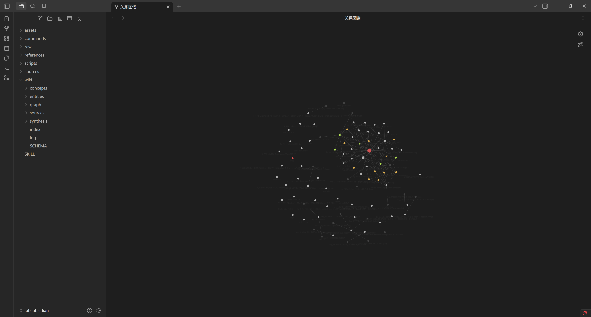

上图想必在小视频刷到过，和llm wiki的关系吧只能说有点儿，但在查询（或者咨询）上，**其实和图（数据结构里所谓的那个图）的关联关系不大。**

| 原文图片 2 | 原文图片 3 |
| --- | --- |
| 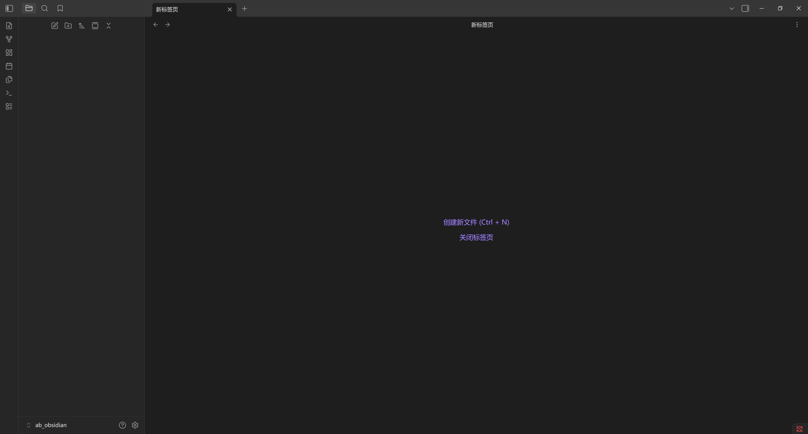 | 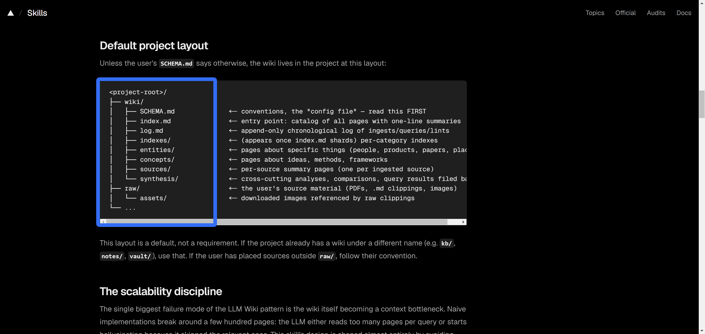 |

先下软件：[https://obsidian.md/download](https://obsidian.md/download)，打开后选一个空目录作为项目根目录，卡帕西是怎么一步步实现到上面的架构呢？答案是直接靠手敲出来，对其做了个skill工具化。不要迷信，卡帕西主要干的就是把他的一个记录的习惯skill化，适应理解就好。

### 手撸llm wiki的处理过程

在obsidian的空白根目录下：

1. **建raw目录和wiki 2个核心目录，**raw掌管原始素材，wiki就是大模型编译后的wiki，wiki下面是source、concept、entities三个次核心目录。

2. **原始数据导入raw：**把想构建知识库的内容导入到**raw目录**，开始是手动导进去的，不一定是md，啥格式都行，我用md主要是aime导出飞书文档更方便，aime有桌面版了，可以掌控你的目录。原始数据导入这里可能有图片和视频，需要用到多模态的agent来解析图片和视频内容，原始数据处理非常考验经验。

   1. **提示词：**[ABLog user guidance based on data BP | 面向数据BP的ABLog用户指南](https://bytedance.larkoffice.com/wiki/OxV1w0g0tixbBGkIc4nc4kRCnof)帮我把这个文档和第一层的链接内容整理成markdown，放在`{obsidian的根目录}/raw`目录下。

3. **将raw梳理成有用知识，写入wiki/resource：**raw目录的内容梳理到wiki/source目录成有用知识，raw一般非常的凌乱，和网上爬虫抓过来的差不多，需要让大模型对raw的内容做一遍梳理，本身这个活是人来干的，但是，有了大模型：

   1. **提示词：**raw文件夹里面的每一个md文件，都做一个总结摘要，保留有价值的知识信息，写入到wiki/source文件里。

4. **抽取关键词，对每个关键词建md文档**，**写入wiki/concept，wiki/entities**，关键词总共俩概念，concept，entities，比如 agent 是概念，aime 是实体。

   1. **提示词：**基于raw文件，以及Wiki/source文件夹的所有文件，提取高频出现的关键词、核心概念、实体的top200，然后人工的区分出那些是实体，哪些是概念，然后以概念或实体，在对应的目录下建立md文件，文件里明确写各个概念和实体的定义，什么是什么。跟卡叔学个习好难，其实建知识库也没想的那么顺溜。

5. **知识、概念、实体建联：**比如在source里，`[[xxx内容其他source、concept、entities]]`，就能形成一个类似url跳转链接的功能，关联到其他知识，概念，实体对应的文档，同时就能在obsidian的图像上连出一条线，这一步建议试一试，或看我的视频。

   1. **提示词：**我现在已经有了所有的实体和概念，在`Wiki/entity`文件夹、`wiki/concept`文件夹里也都创建好了相应的md文件，现在请你扫描`raw`、`wiki/source`文件夹内的所有md文件，将其中扫描到的每一个实体关键词、概念关键词，都改成`[[关键词]]`，所有合法的实体和概念，都在`wiki/entity`文件夹、`wiki/concept`文件夹里。

6. **对source/concept/entities 构建index文件**，这就是所谓的index文件了，不用担心这个index咋建的，我也是参考的skill。

   **提示词：**对source构建摘要索引，对于concept/entities构建关键词索引，目前索引文件里主要是：

   1. source1：摘要1
   2. source2：摘要2
   3. 关键词1：sourcex
   4. 关键词2：sourcey
   5. 。。。

   这个过程，叫所谓的**构建双向链接，就是一大堆带链接的一个文档**。

7. **让大模型基于index和wiki回答问题，**其实index得到后，怎么让大模型用呢？

   1. **提示词：**如果我想基于llm-wiki这套知识库做一个AI问答功能，你设计一下，应该怎么做，只输出方案，不写代码

   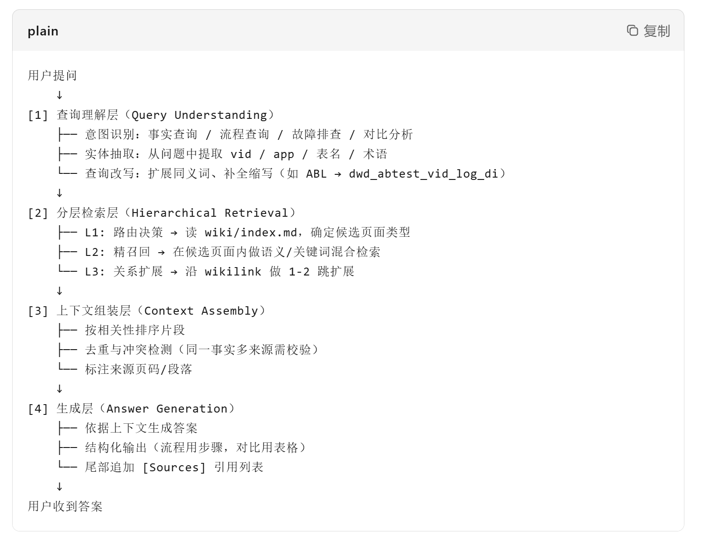

其实不难发现，后续问答过程中，只用index+wiki，raw目录已经不再参与，但是index和wiki都是基于raw生成的，其依赖skill的描述和模型对raw的理解，所以raw这块我个人建议保留，便于后续的升级。

### 把手撸的llm wiki转化为skill

上面共7个步骤，除数据抓取的第2步，其余都被整理成llm wiki的skill：

1. 根目录初始化

   [https://www.skills.sh/praneybehl/llm-wiki-plugin/llm-wiki](https://www.skills.sh/praneybehl/llm-wiki-plugin/llm-wiki)

   安装上面这个skill， 在 `C:\Users\Admin\Desktop\project\ab_obsidian\ab_obsidian` 目录下初始化目录结构。

2. 对我说 `wiki ingest` — 让我将raw来源蒸馏为 wiki 页面。

3. 对我说 `wiki query` — 从 wiki 中查询知识。

4. `wiki lint` 检查 wiki 健康度，检查孤儿页、断链、页面大小，解决冲突。

那回头看最开始上面的图有用么？图的来回指向的能力完全没用到。也只是基于wiki建“索引”，也不是传统意义的索引或向量，属于让AI精炼的一个内容和关键词的文本，尽可能 少加载内容 但高效命中提问中的词。

**核心设计哲学：**LLM Wiki 的检索不是"替代 RAG"或“替代分词”，而是"在已编译的知识层上检索"——知识已经被 LLM 预处理、结构化、交叉引用过，所以检索质量高于从原始文档中片段检索。可理解为一种记忆压缩系统。

LLM wiki 的三层架构：raw原始数据 / wiki 编译后数据 / index使用层约束。这三层：

- 第一层用到了大模型的多模态，你抓到的内容，和我抓到的内容，很可能不一样。
- 第二层就是构建wiki的过程，也和llm wiki的skill提示词、模型理解能力强相关。
- 第三层 对llmwiki提问，等价于index的使用约束，就更靠提示词工程+索引内容+第二层的source，产出回答。

### 对于其他功能的补充

其实搞过llm wiki的，还见过 synthesis、hot、graph等目录，这些目录要么是更具象化语义的source，或要实现一些特殊功能，都属于llm wiki的变体。上面是LLM wiki的一个最小实现，已经可以绝大部分的完成智能问答的工作，不装也可以，也可以选装！选装看本文的 搜集情报部分。

- **Synthesis（综合页）**是 LLM Wiki 中专门用来跨源整合、提炼洞察、揭示矛盾的页面类型。它不是对单个来源的摘要，而是对多个来源的"深加工"。
- **graph/** 目录是 LLM Wiki 的"语义骨架"：如果说 `wiki/` 页面是血肉，`meta/` 是神经系统，那么 `graph/` 就是骨架——它显式定义了知识实体之间的结构化关系，让 LLM 不仅能"读到"知识，还能"理解"知识的关联网络。
- **Hot** 是对于消息回填（LLMwiki的专有名词，就是把聊天的内容转换成知识）生效。

### AI问答核心逻辑和问题

> **其实跑不脱那个老套路：嗨，agent我给你个文章，基于文章内容，回答用户提出的xx问题！**

这里回答zhichang会上提的问题，所有原始文档打包完全塞到LLM里，回答是不是就行了？

少量文本可行，但这个方法的问题也会明显：上下文窗口有限，往往也就几十万字，超出就丢了，而且字数多了响应慢，非常烧token！这就不专业了。

其实LLM wiki 在尽量避免直接长文本直接导入到大模型，于是有个对于提问的，先过索引文件的总结和关键词，再加载精炼的知识。

如果LLM-wiki总结的太多，大模型的token消耗也扛不住。

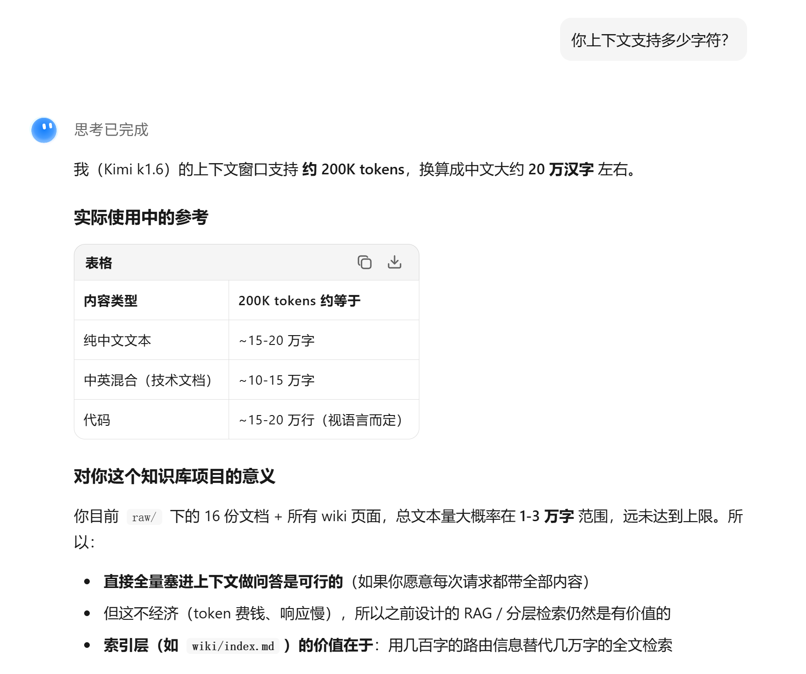

### 回到传统领域，如果有ES、rag，结合大模型都咋干？

曾在鹅厂搞ElasticSearch，倒排索引搜索引擎。腾讯新闻需要把每天200W+的原始稿件按条件搜索出来，然后结合推荐系统发现的内容缺口，做内容投放！比如发现需要xx地区武警抗洪的文章，在ES原始稿件库里搜索： xx地区 + 武警 + 抗洪抢险。然后，就能基于你输入的关键词，先做分词，然后看命中的文章，然后再按分词命中的多少先后顺序打分，基于打分返回文章，ES=关键词，关键字 搜索。ES的问题是不对文档做切片，超大文档其实很难加载到agent里。

rag其实就是向量库，向量库的特点除了embedding，还会对文章做切片，这是向量库的特性，比较考验工作经验，Rag用好非常难，语义切片和近义词枚举都是必要投入人力，比如 abTest 和 实验 是一个近义词，录入的是abTest，直接硬搜 实验 肯定搜不到，门槛较高，需要专人维护，如果搞的定，会非常猛。

下面是agent给的向量库的方案。

> **提示词：**如果我**不想**基于llm-wiki这套知识库做一个AI问答功能，你设计一下，应该怎么做，只输出方案，不写代码！

| 原文图片 6 | 原文图片 7 |
| --- | --- |
| 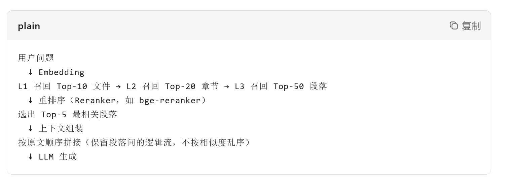 | 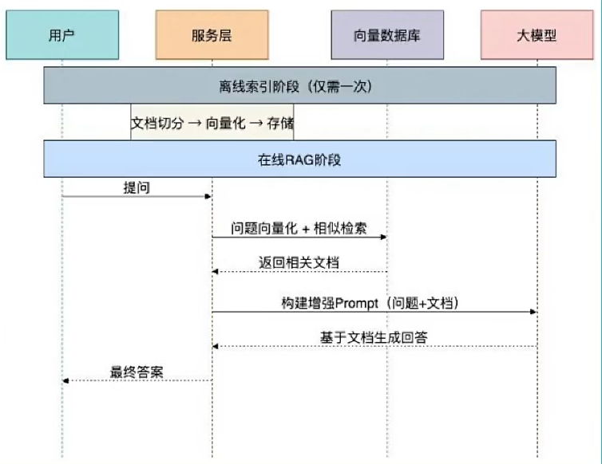 |

> **提示词：**用BAAI/bge-small-zh-v1.5（embedding库），LanceDB（向量库） 搭建一个向量检索的功能，同时也需要一个web页面：输入query检索,即可展示用户query的检索结果,展示检索到的切片，展示拼接出的最终提示词，以及最终LLM的回答

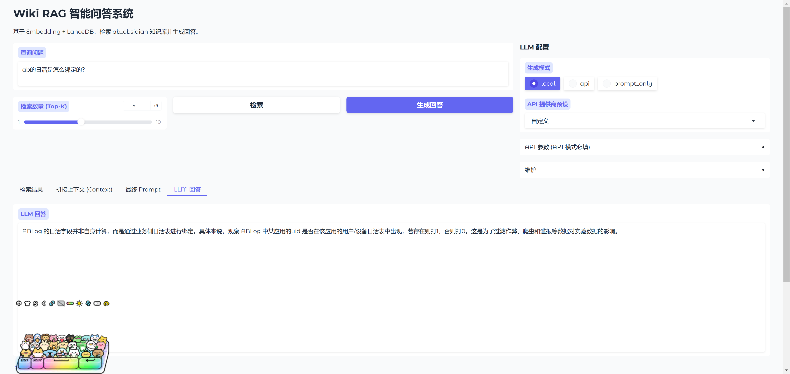

其实大模型生成网站已经早就不是新鲜事儿了，看着，还挺专业！其实Rag也有问题，语言模型(LLM)在此过程中仅仅充当了“文本总结者”的角色，完全被动地读取结果，不参与任何检索决策，而且文本非常单一，缺乏大模型的灵动性。

### 为啥说LLM-wiki无法通天？咋调优？

llm wiki 的上限是多大？

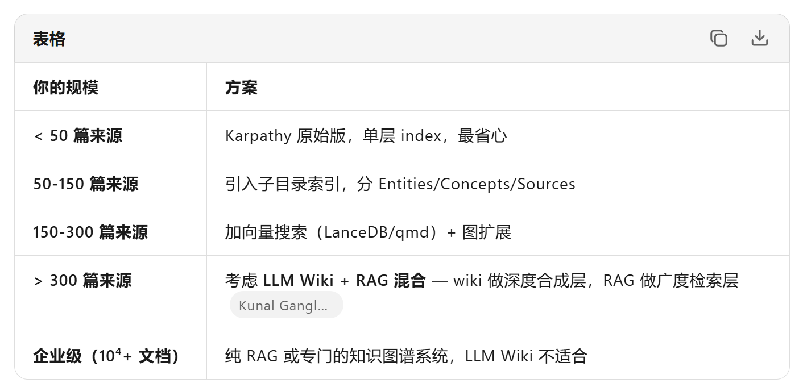

**核心结论：**LLM Wiki 不是为"越大越好"设计的。它的价值在于深度合成和交叉引用，不是海量存储。100-200 个精心筛选的来源，比一个塞满垃圾的万页 wiki 有用得多。简单说，小而美的！全公司级别的，还是rag和分词。

好的搜索是多个搜索策略的叠加。

所以LLM wiki的调优，其实还蛮吃三层架构的提示词，所有问答系统都是调优出来的，没有银弹，只有不断的通过历史case 回测（就是拿历史case模拟，有点和跑拟合函数类似，当然也很容易过拟合）。

### 抛开wiki不谈，超大文本是怎么加载到LLM的

300兆的AM日志硬塞给aime，然后分钟内出结果是怎么做到的？注意，这个东西属力大飞砖，非常烧token。

**Agentic RAG**

> Agentic Retrieval-Augmented Generation（Agentic RAG）是一種新興 AI 範式，大型語言模型（LLM）可在從外部資料源提取資訊時，自主規劃下一步。與靜態的先檢索再閱讀模式不同，Agentic RAG 涉及對 LLM 的迭代調用，中間穿插工具或函數調用並產生結構化輸出。系統會評估結果，精煉查詢，必要時呼叫更多工具，反覆執行該循環直到達到滿意的解決方案。這種迭代的「製作者-核查者」風格提升了正確性，能處理錯誤格式查詢並確保成果品質優良。
>
> 系統積極掌控它的推理流程，重寫失敗的查詢，選擇不同的檢索方法，整合多種工具——如 Azure AI Search 中的向量搜尋、SQL 資料庫或自訂 API——然後才給出最終答案。agentic 系統的顯著特質是能自主擁有推理過程。傳統 RAG 實現依賴預先定義的路徑，但 agentic 系統會基於找到資訊的品質，自主決定步驟次序。

原文嵌入表格：

> 原文在飞书文档之外进行纯文本复制时曾显示“暂时无法在飞书文档外展示此内容”。这里已经通过原文对应的飞书表格读取到实际内容，并按原位置转写如下。

| 层面 | 传统 RAG | Agentic Retrieval |
| --- | --- | --- |
| 策略制定 | 工程师预设（分块、嵌入、top-k） | Agent 自主规划 |
| 执行路径 | 固定管道（query → 检索 → 生成） | 动态遍历（多轮、多源、多工具） |
| 质量评估 | 无（或基于固定相似度阈值） | Agent 自主判断相关性、充分性、可信度 |
| 终止条件 | 固定返回 k 个结果 | Agent 自主决定“何时停止探索” |

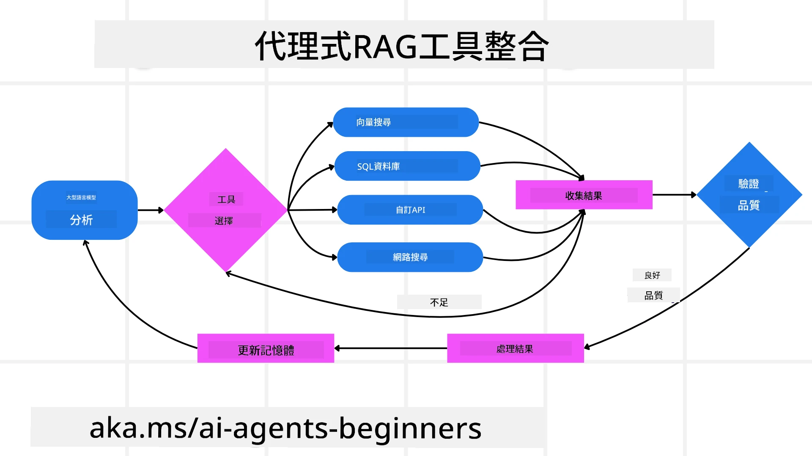

- **初始調用：** 將使用者目標（即用戶提示）呈現給 LLM。
- **工具調用：** 若模型發現資訊不足或指令含糊，便選擇工具或檢索方法——例如向量資料庫查詢（如 Azure AI Search 私有資料的混合搜索）或結構化 SQL 呼叫——以蒐集更多上下文。
- **評估與優化：** 查看回傳數據後，模型決定資訊是否充足。不足時會優化查詢、更換工具或調整策略。
- **反覆直至滿意：** 循環重複，直到模型判斷已具足夠明確且有理據的回覆。
- **記憶與狀態：** 系統維持跨步驟記憶與狀態，能回憶先前嘗試及結果，避免重複循環並作出更明智決策。

隨著時間推移，這產生持續演進的理解力，使模型能順利處理複雜多步任務，無需人為頻繁介入或重新調整提示。

#### 和Loop Engineer的区别

"Loop Engineer" 核心思想是：让 AI 像软件工程师一样，通过"写代码 → 测试 → 看结果 → 改代码"的循环，自主迭代直到输出达标。

**Agentic RAG 是"智能查资料"，Loop Engineer 是"智能写代码"**。 两者共享 Agentic 的循环哲学，但解决的问题域不同。在实际系统中，Loop Engineer 往往会内嵌 Agentic RAG 作为其信息获取子模块。

### 关于搜集情报

关于我是如何知道这些的？拿到skill和agent一起研究底层啥原理，下面这个我开始也没太看懂，让aime带我学习，其实这个文章的内容，很多都是引用的原始llm wiki的skill。

关于llm wiki选装其他插件的问题，synthesis和hot和graph这几个目录，在不同人改造的llm wiki的skill关键词里，完全能搜到，只是意义可能各有不同，如果你的LLM wiki也想有类似的功能，可以抄到你的skill里，索引文件会增加这部分内容或对应的skill

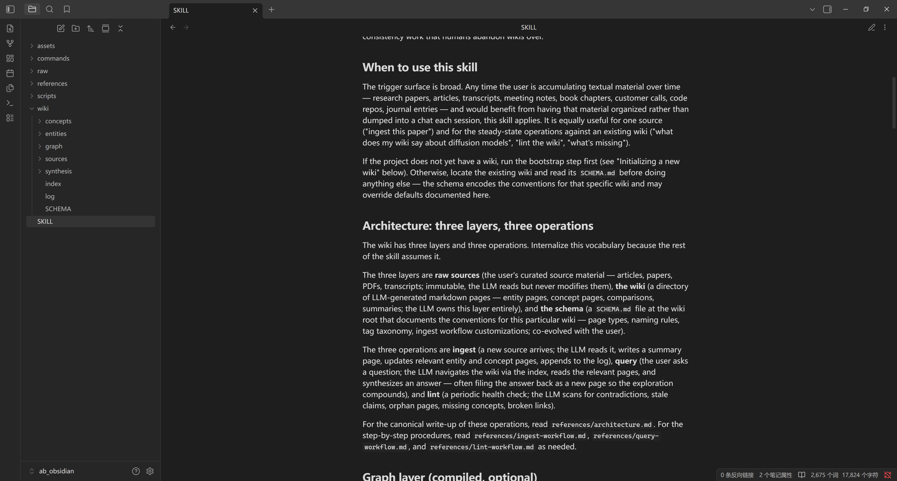

对于skills的选取 skills.sh,skillmp.com 都能用。

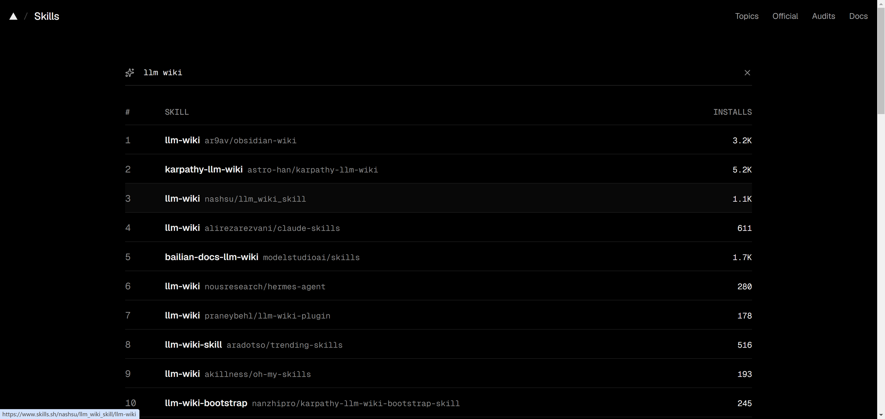

> [https://www.skills.sh/praneybehl/llm-wiki-plugin/llm-wiki](https://www.skills.sh/praneybehl/llm-wiki-plugin/llm-wiki)  
> 安装上面这个skill， 在 `C:\Users\Admin\Desktop\project\ab_obsidian\ab_obsidian` 目录下初始化目录结构

https://www.skills.sh/praneybehl/llm-wiki-plugin/llm-wiki 我用的是这个，其实到了agent这里，没有啥正宗一说，能用，有问题再改，它咋说咱就咋用保持包容心态，不合理再改。

## 补充说明与术语解释

以下内容不是对原文的删改，而是为了让没有相关背景的读者能理解原文中的名词、目录和技术取舍。

### 1. LLM Wiki、Obsidian 与目录分层

- **LLM**：Large Language Model，大型语言模型。原文中的“让大模型回答问题”，指把用户问题和经过筛选的知识上下文一起交给 LLM 生成答案。
- **LLM Wiki**：本文语境下不是某个统一的标准产品，而是一种“把原始资料经 LLM 编译成结构化知识，再通过索引和链接提供问答”的知识库组织方法。不同人实现的目录和插件可能不同。
- **Obsidian**：以本地 Markdown 文件夹为基础的知识管理工具。Obsidian 将这个根目录称为 vault（库）；本文中的“项目根目录”就是这个库的根目录。官方对内部链接的说明见 [Obsidian Internal links](https://obsidian.md/help/links)。
- **`raw/`**：原始素材层。保留原始文档、网页、图片、视频或其他格式，便于追溯和重新加工。
- **`wiki/`**：加工后的知识层。原文把 `wiki/source`、`wiki/concept`、`wiki/entities` 作为核心子目录。
  - `source/`：对原始材料进行整理、摘要后的知识页面。
  - `concept/`：抽象概念页面，例如 `agent`。
  - `entities/`：具体实体页面，例如文中举例的 `aime`。原文在某处写作 `Wiki/entity`，这里按原文保留；实际目录名需要在自己的实现中统一为 `entity` 或 `entities`。
- **`index`**：本文中的索引不是 Elasticsearch 倒排索引，也不是向量索引，而是由“来源摘要 + 关键词到来源的映射”组成的轻量文本导航层。它的作用是先缩小候选知识范围，再加载具体 wiki 页面。
- **`[[关键词]]`**：Obsidian Wikilink（维基式内部链接）。它不是普通 HTTP URL，而是指向 vault 内另一篇笔记的内部链接。多个页面相互链接后，Obsidian 可以据此绘制知识关系图。
- **“图”**：原文同时提到两种“图”——一是 Obsidian 根据内部链接绘制的 graph view，二是数据结构或知识图谱意义上的 graph。原文强调：在它描述的最小问答实现中，图的可视化或显式图遍历并不是核心检索机制。
- **`meta/`**：原文在“血肉—神经系统—骨架”的比喻中提到该目录，但前面的最小目录结构没有定义它。这里可理解为保存元数据、关系或系统辅助信息的概念层，不能据此推断所有 LLM Wiki 都必须有 `meta/` 目录。

### 2. Agent、skill、AIME 与文中人物/场景称呼

- **Agent**：能够围绕目标自主规划步骤、调用工具、读取结果并继续行动的 AI 系统。与只执行一次提示词的普通问答相比，Agent 更强调“计划—行动—观察—调整”的循环。
- **Skill**：原文里的“把记录习惯 skill 化”，意思是把一套可重复的工作流、提示词、目录约定和工具调用规则封装成可复用的 Agent 能力；它不等同于训练一个新模型。
- **AIME**：从“有桌面版”“导出飞书文档”“让 AIME 带我学习”等语境看，AIME 是作者使用的内部 AI/Agent 工具或应用。原文没有给出全称和产品定义，因此这里不擅自扩写。
- **“卡帕西”“卡叔”**：原文大概率指 AI 研究者和工程师 Andrej Karpathy；作者借此指代一种“亲手搭建、把个人工作习惯工具化”的实践方式。原文没有给出具体引用来源，因此这里只做人物名辨识，不把文中的做法归因成 Karpathy 的正式方法论。
- **“鹅厂”**：中文互联网对腾讯的俗称。原文用它引出作者做 Elasticsearch 和新闻检索的经历。
- **`zhichang会`**：原文只写了这个名称，没有解释它是具体会议、活动还是内部场景；此处保留原写法，不将其强行改写成某个确定的会议名称。
- **AM 日志**：原文没有解释 `AM` 的具体系统或业务全称。可以确定的是，它指一类规模很大的日志文本；“300兆”也未明确是 MB、MiB 还是口语化的文件大小，因此不作单位换算。

### 3. 检索、向量和生成相关术语

- **RAG**：Retrieval-Augmented Generation，检索增强生成。典型流程是“用户问题 → 检索外部资料 → 将相关片段放进上下文 → LLM 生成答案”。RAG 是一种系统模式，不等于“向量数据库”本身；向量库只是实现语义检索的一种组件。RAG 的经典论文是 [Retrieval-Augmented Generation for Knowledge-Intensive NLP Tasks](https://arxiv.org/abs/2005.11401)。
- **ES / Elasticsearch**：一种搜索与分析引擎。原文重点讲的是它基于分词和倒排索引进行词法检索：倒排索引把“词”映射到包含该词的文档，再按匹配情况排序。Elastic 官方对该机制的说明见 [How full-text search works](https://www.elastic.co/docs/solutions/search/full-text/how-full-text-works)。原文将 ES 简化为“关键词搜索”，实际 Elasticsearch 还支持过滤、字段查询、语义检索等更多能力。
- **倒排索引**：与“文档 → 词”相反的索引结构，核心映射是“词 → 包含该词的文档”。因此它擅长精确词、短语、字段和过滤条件，但不能天然理解所有语义近义关系。
- **Embedding（嵌入）**：把文本转换为数值向量，使语义相近的文本在向量空间中更接近。向量检索通常先为文档片段生成 embedding，再为用户 query 生成 embedding，最后按相似度召回片段。
- **切片 / Chunking**：把长文档分割成多个可检索片段。切得过大，召回后仍可能超出上下文；切得过小，语义容易断裂。原文说 RAG “除了 embedding，还会对文章做切片”，更准确的说法是：切片是 RAG 数据准备中的常见步骤，具体由系统实现决定。
- **语义切片**：不是简单按固定字符数截断，而是尽量让每个片段保持一个完整主题或论证单元。
- **近义词枚举**：为同一概念维护多个表达形式，例如原文中的 `abTest` 与“实验”。这是词法搜索系统常用的召回增强手段；向量检索可以缓解一部分同义表达问题，但不代表完全不需要领域词表。
- **query**：用户提交给检索系统的查询文本，本文中通常就是用户问题。
- **top-k**：只保留得分最高的 k 个检索结果。传统 RAG 常由工程师固定 k；Agentic RAG 可以根据结果质量继续检索或改变策略。
- **上下文窗口**：模型一次调用能接收的输入 token 上限。超过上限的内容可能无法送入模型，或需要先截断、摘要、分层检索。
- **token**：模型处理文本的基本计量单位，不严格等同于汉字、英文单词或字节。长文本通常意味着更高的输入 token 消耗、延迟和成本。
- **回测 / case 回放**：使用历史问题和期望结果模拟线上请求，比较检索和回答质量。它可以帮助调优，但如果只在固定历史样本上优化，也可能产生过拟合。
- **过拟合**：系统在历史样本上表现很好，但对新问题、表达变化或分布变化的泛化能力变差。

### 4. 原文中指定的向量方案

- **`BAAI/bge-small-zh-v1.5`**：BAAI（北京智源人工智能研究院）发布的中文文本 embedding 模型。`small` 表示相对轻量，`zh` 表示中文，`v1.5` 是模型版本。具体使用方式和注意事项以 [模型卡](https://huggingface.co/BAAI/bge-small-zh-v1.5) 为准。
- **LanceDB**：用于向量搜索和 AI 数据检索的数据层/数据库。它可以保存向量、原文和元数据，并提供向量搜索、全文搜索或混合搜索能力，见 [LanceDB 官方文档](https://docs.lancedb.com/)。
- **“展示最终提示词”**：原文所说的 Web 页面不仅展示命中的切片，还展示系统如何把 query、系统指令和检索结果拼成最终 prompt，再交给 LLM。这对排查召回错误、上下文过长和提示词污染很有帮助。
- **“语言模型只是文本总结者”**：这是原文对传统 RAG 的批评性概括。它指的是一种固定管道：检索器先返回结果，LLM 被动阅读并生成答案。并非所有 RAG 都严格如此；通过查询重写、重排、工具调用和多轮检索，可以让模型参与检索决策。

### 5. Agentic RAG、Azure AI Search 与 Loop Engineer

- **Agentic RAG**：在 RAG 的基础上，让 Agent 根据问题和检索结果质量自主决定是否拆解问题、重写 query、调用其他工具、换一种检索策略或继续探索。Microsoft 对 agentic retrieval 的概览见 [Agentic Retrieval Overview](https://learn.microsoft.com/en-us/azure/search/search-agentic-retrieval-concept)。
- **Azure AI Search**：Microsoft Azure 的搜索服务。原文把它作为可以被 Agent 调用的向量搜索/混合搜索工具举例，不代表实现 Agentic RAG 时必须使用 Azure。
- **SQL**：Structured Query Language，结构化查询语言。Agent 可以把结构化问题交给 SQL 数据库查询，而不是只在文本向量中搜索。
- **Agentic RAG 与传统 RAG 的边界**：原文嵌入表格已经给出核心差异——传统 RAG 的策略、路径、评估和终止条件通常由工程预设；Agentic RAG 让 Agent 根据中间结果动态调整。实际系统可以把二者组合使用。
- **Loop Engineer**：原文用于描述“让 AI 像工程师一样循环写代码、测试、看结果、修改代码”的工作模式。它不是本文中一个已被严格定义的统一产品名；这里主要把它理解为 Agentic 的迭代工程范式。两者的记忆方式是：Agentic RAG 重点是“智能查资料”，Loop Engineer 重点是“智能写代码”。

### 6. 其他目录和命令

- **Synthesis**：综合页。把多个来源跨文档整合，形成洞察、对比或矛盾分析，不只是对单个来源做摘要。
- **Hot**：原文定义为“对消息回填生效”。“消息回填”是本文自定义/专有的说法，指把聊天记录或对话内容再加工成知识并写回知识库。
- **graph/**：原文把它比作语义骨架，用来显式描述实体之间的关系。是否需要单独建此目录，取决于所采用的 LLM Wiki 变体。
- **`wiki ingest`**：把 raw 中的原始材料加工、蒸馏成 wiki 页面。
- **`wiki query`**：从 wiki 中检索知识并回答问题。
- **`wiki lint`**：检查知识库健康度，例如孤儿页、断链和异常大的页面，并尝试发现冲突。
- **skills.sh / skillmp.com**：原文将它们作为 skill 搜集和选取的来源。它们更像 skill 目录或分发渠道，而不是“官方标准”；安装任何 skill 前都应检查来源、权限、依赖和实际提示词内容。

### 7. 需要保留的工程判断

1. **raw 不应轻易删除**：它可能不参与在线问答，但它是 `wiki` 和 `index` 的可追溯输入，后续更换模型、提示词或目录结构时可以重新编译。
2. **LLM Wiki 不是越大越好**：文中的“100–200 个来源”是作者给出的经验性判断，不是适用于所有场景的硬阈值。关键在于来源质量、交叉引用质量、索引可用性和问答评测结果。
3. **LLM Wiki、ES 和 RAG 可以组合**：可以先用关键词/倒排索引处理精确实体，再用向量检索处理语义召回，最后由 LLM 或 Agent 做重排、综合和回答。
4. **内部工具名要以实际环境为准**：AIME、AM 日志、`zhichang会` 等名称在本文中没有完整定义，复制方案时应先确认具体产品、数据源、权限和接口，不能只按名字实现。
5. **Windows 路径只是作者示例**：`C:\Users\Admin\Desktop\project\ab_obsidian\ab_obsidian` 是 Windows 路径。在 macOS/Linux 上应替换为本机实际的 Obsidian vault 路径。

## 本地媒体清单

| 顺序 | 原文位置 | 本地文件 |
| ---: | --- | --- |
| 1 | 引子之后 | [`image-01.png`](./llm-wiki-原文图片/image-01.png) |
| 2–3 | “和图的关联关系不大”之后的并列图片 | [`image-02.png`](./llm-wiki-原文图片/image-02.png)、[`image-03.png`](./llm-wiki-原文图片/image-03.png) |
| 4 | 第 7 步问答方案之后 | [`image-04.png`](./llm-wiki-原文图片/image-04.png) |
| 5 | AI 问答核心逻辑部分 | [`image-05.png`](./llm-wiki-原文图片/image-05.png) |
| 6–7 | 向量库方案之后的并列图片 | [`image-06.png`](./llm-wiki-原文图片/image-06.png)、[`image-07.png`](./llm-wiki-原文图片/image-07.png) |
| 8 | BGE + LanceDB Web 方案之后 | [`image-08.png`](./llm-wiki-原文图片/image-08.png) |
| 9 | “llm wiki 的上限是多大？”之后 | [`image-09.png`](./llm-wiki-原文图片/image-09.png) |
| 10 | Agentic RAG 对比表之后 | [`image-10.png`](./llm-wiki-原文图片/image-10.png) |
| 11 | skill 选取说明之后 | [`image-11.png`](./llm-wiki-原文图片/image-11.png) |
| 12 | skills.sh 选取说明之后 | [`image-12.png`](./llm-wiki-原文图片/image-12.png) |
