# Golang 面试题

prompt:

你是一个 Go 语言的专家，我在为应聘 Go 语言后端岗位的面试做准备，所以接下来我会问你一些与 Go 语言和后端相关的问题。注意我想把每个问题以及你给我的回答记录下来，因此你需要确保你的回答的正确性和严谨性，同时你要确保你的回答是有条理的、逻辑明确的，这样我在后续复盘时能方便地回顾，此外，你的回答应当是细致的、深入的，因为这是面试问题，不能仅仅局限于表面，要深挖内核。我会使用 markdown 做笔记，因此你最好以 markdown 的格式回答我的问题。同时最好辅以例子说明，这样便于我的理解，如果能有有关代码及详细注释就更好了。在最后你需要进行知识扩展，讲讲你认为和这个知识点相关联的其他知识点，不需要太细，只需要说明有着怎样的关联即可。另外，如果有括号的话，请用英文括号 () 而不是中文括号（）。

## 1. 基础面试题

### 1.1 协程和线程和进程的区别

- 进程：进程是具有一定独立功能的程序，进程是系统资源分配和调度的最小单位。每个进程有自己的独立内存空间，不同进程通过进程间通信来通信。由于进程比较重量，占据独立的内存，所以上下文进程间的切换开销 (栈、寄存器、虚拟内存、文件句柄等) 比较大，但相对比较稳定安全。
- 线程：线程是进程的一个实体，线程是内核态，而且是 CPU 调度和分派的基本单位，它是比进程更小的能独立运行的基本单位。线程间通信主要通过共享内存，上下文切换很快，资源开销较小，但相比进程不够稳定且容易丢失数据。
- 协程：协程是一种用户态的轻量级线程，协程的调度完全由用户来控制。协程拥有自己的寄存器上下文和栈。协程调度切换时，将寄存器上下文和栈保存到其他地方，在切回来的时候，恢复先前保存的寄存器上下文和栈，直接操作栈则基本没有内核切换的开销，可以不加锁地访问全局变量，所以上下文的切换非常快。

### 1.4 Golang 中 make 和 new 的区别

- make:
  - 用于初始化并分配内存，只能用于创建 `slice`, `map` 和 `channel` 三种类型
  - 返回的是初始化后的数据结构，而不是指针
- new:
  - 用于分配内存，但不初始化，返回的是指向该内存的指针
  - 可以用于任何类型的内存分配

make 函数创建的是数据结构 (slice, map, channel) 本身，且返回初始化后的值。而 new 函数创建的是可以指向任意类型的指针，返回指向未初始化零值的内存地址。

### 1.7 如何高效地拼接字符串

拼接字符串的方式有：

- `+`
- fmt.Sprintf
- strings.Builder
  - 用 WriteString() 进行拼接，内部实现是指针+切片，同时 String() 返回拼接后的字符串，它是直接把 []byte 转换为 string，从而避免变量拷贝。
  - var sb strings.Builder
- bytes.Buffer
- strings.Join

### 1.8 defer 的执行顺序是怎样的？defer 的作用或者使用场景是什么

defer 执行顺序和调用顺序相反，类似于栈的后进先出 (LIFO)

defer 的作用是：当 defer 语句被执行时，跟在 defer 后的函数会被延迟执行。直到包含该 defer 语句的函数执行完毕时，defer 后的函数才会被执行，不论包含 defer 语句的函数是通过 return 正常结束，还是由于 panic 导致的异常结束。可以在一个函数中执行多条 defer 语句，它们的执行顺序与声明顺序相反。

defer 的常用场景：

- defer 语句常用语处理成对的操作，如打开、关闭、链接、断开连接、加锁和释放锁
- 通过 defer 机制，不论函数逻辑多复杂，都能保证在任何执行路径下，资源被释放
- 释放资源的 defer 应当直接跟在请求资源的语句后

### 1.10 Go 语言 tag 有什么用

tag 可以为结构体成员提供属性

- json 序列化或反序列化时字段的名称
- db: sqlx 模块中对应的数据库字段名
- form: gin 框架中对应的前端的数据字段名
- binding: 搭配 form 使用，默认如果没查找到结构体中的某个字段则不报错值为空，bingding 为 required 代表没找到返回错误给前端

### 1.11 Go 打印时 %v %+v %#v 的区别

- %v 只输出所有的值
- %+v 先输出字段名字，再输出该字段的值
- %#v 先输出结构体名字值，在输出结构体 (字段名 + 字段值)

### 1.13 Go 语言中，空 struct{} 用什么用？

空struct{}不占用任何空间

- 用 map 模拟一个 set，那么就要把值置为 struct{}，struct{} 本身不占任何空间，可以避免任何多余的内存分配
  - 例如对于一个名为 set 的 map，set["apple"] = struct{}{}
- 有时候给通道发送一个空结构体 channel <- struct{}{}，可以节省空间

### 1.14 init() 函数是什么时候执行的？

init() 函数在 main 函数之前执行

init() 函数是 go 初始化的一部分，由 runtime 初始化每个导入的包，初始化不是按照从上到下的导入顺序，而是按照解析的依赖关系，没有依赖的包最先初始化

每个包首先初始化包作用域的常量和变量 (常量优先于变量)，然后执行包的 init() 函数。同一个包，甚至是同一个源文件可以有多个 init() 函数。init() 函数没有参数和返回值，不能被其他函数调用，同一个包内多个 init() 函数的执行顺序不做保证

执行顺序：import -> const -> var -> init() -> main()

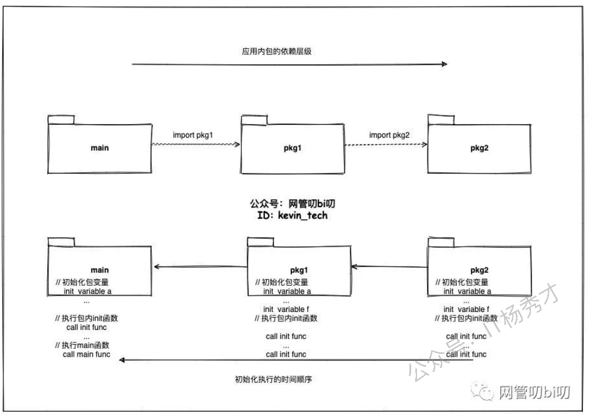

### 1.17 Go 函数传参是值类型还是引用类型？

- 在 Go 语言中只存在值传递，要么是值的副本，要么是指针的副本。无论是值类型的变量还是引用类型的变量亦或是指针类型的变量作为参数传递都会发生值拷贝，开辟新的内存空间
- 另外值传递、引用传递和值类型、引用类型是两个不同的概念。引用类型作为变量传递可以影响到函数外部是因为发生值拷贝后新旧变量指向了相同的内存地址
- map 和 channel 是引用类型 (底层是指针结构)
  - 传递的是 map 或 channel 的描述符 (类似指针) 的副本，但它们仍指向同一个底层数据结构

### 1.18 如何知道一个对象是分配在栈上还是堆上？

Go 和 C++ 不同，Go 局部变量会进行逃逸分析，如果变量离开作用域后没有被引用，则优先分配到栈上，否则分配到堆上

如何判断是否发生了逃逸 (escape) ？

```sh
go build -gcflags '-m -m -l' xxx.go 
```

关于逃逸的可能情况：变量大小不确定，变量类型不确定，变量分配的内存超过用户栈最大值，暴露给了外部指针

### 1.19 Go 的多返回值是如何实现的？

Go 的多返回值是通过在函数调用栈帧上预留空间并进行值复制来实现的。在函数调用发生时，Go 编译器会计算出函数所有返回值的总大小。在为该函数创建栈帧时，就会在调用方 (caller) 的栈帧上，为这些返回值预留出连续的内存空间

当函数执行到 return 语句时，它会将其要返回的各个值复制到这些预留好的栈空间中。函数执行完毕后，控制权返回给调用方。此时，调用方可以直接从它自己的栈帧上 (即之前为返回值预留的空间) 获取这些返回的值

### 1.21 Go 普通指针和 unsafe.Pointer 有什么区别？

普通指针比如 *int，*string，他们有明确的类型信息，编译器会进行类型检查和垃圾回收跟踪。不同类型的指针之间不能直接转换，这是 Go 类型安全的体现

unsafe.Pointer 是 Go 的通用指针类型，可以理解为 C 的 void *，它绕过了 Go 的类型系统，unsafe.Pointer 可以与任意类型的指针相互转换，也可以与 uintptr 进行转换来做指针运算

另外，普通指针受 GC 管理和类型约束，unsafe.Pointer 不受类型约束但仍受 GC 跟踪

### 1.22 unsafe.Pointer 和 uintptr 有什么区别？

unsafe.Pointer 和 uintptr 可以相互转换，这是 Go 提供的唯一合法的指针运算方式。典型用法是先将 unsafe.Pointer 转换为 uintptr 做算术运算，然后再转回 unsafe.Pointer 使用

最关键的区别在于 GC 追踪，unsafe.Pointer 会被垃圾回收器追踪，它指向的内存不会被错误回收。而 uintptr 只是一个普通整数，GC 完全不知道它指向什么，如果没有其他引用，对应内存可能随时被回收。

unsafe.Pointer 有 GC 保护，uintptr 没有，这是它们最本质的区别。

## 2. Slice 面试题

### 2.1 slice 的底层结构是怎样的？

slice 的底层数据结构也是数组，slice 是对数组的封装，它描述一个数组的片段。slice 实际上是一个结构体，包含三个字段

- 长度
- 容量
- 底层数组

```go
type slice struct {
  // 元素指针
  array unsafe.Pointer
  // 长度
  len int
  // 容量
  cap int
}
```

### 2.3 从一个切片截取出另一个切片，修改新切片的值是否会影响原来的切片内容？

在截取完之后，如果新切片没有触发扩容，则修改切片元素会影响原切片，如果触发了扩容则不会

在 Go 1.18及之后，引入了新的扩容规则

当原 slice 容量 (oldcap) 小于 256 时，新 slice (newcap) 容量为原来的 2 倍；原 slice 容量超过 256，新 slice 容量 newcap = oldcap + (oldcap + 3 * 256) / 4

## 3. Map 面试题

### 3.1 Go Map 的底层实现原理

map 是一个 hmap 结构，Go Map 的底层实现是一个哈希表，它在运行时表现为一个指向 hmap 结构体的指针，hmap 中记录了通数组指针 buckets、溢出桶指针以及元素个数等字段。每个桶是一个 bmap 结构体，能存储 8 个键值对和 8 个 tophash，并有指向下一个溢出桶的指针 overflow。为了内存紧凑，bmap 中采用的是先存 8 个键再存 8 个值的存储方式

```go
type hmap struct {
  // map 中元素的个数
  count int
  // 状态标志位，记录 map 的状态
  flags uint8
  // 桶数以 2 为底的对数，决定了哈希表的大小，即 B = log_2(len(buckets))，比如 B = 3，那么桶的数量为 2^3 = 8
  B uint8
  // 溢出桶的数量的近似值
  noverflow uint16
  // 哈希种子，用于计算哈希值
  hash0 uint32

  // 指向 buckets 数组的指针，buckets 数组的大小为 2^B，每个桶存储 8 个键值对
  buckets unsafe.Pointer
  // 一个指向 buckets 数组的指针，在扩容时，oldbuckets 指向老的 buckets 数组 (大小为新buckets数组的一半)，非扩容时，oldbuckets 为空
  oldbuckets unsafe.Pointer
  // 表示扩容进度的计数器，小于该值的桶已经完成迁移
  nevacuate uintptr

  // 指向 mapextra 结构体的指针，mapextra 存储 map 中的溢出桶
  extra *mapextra
}
```

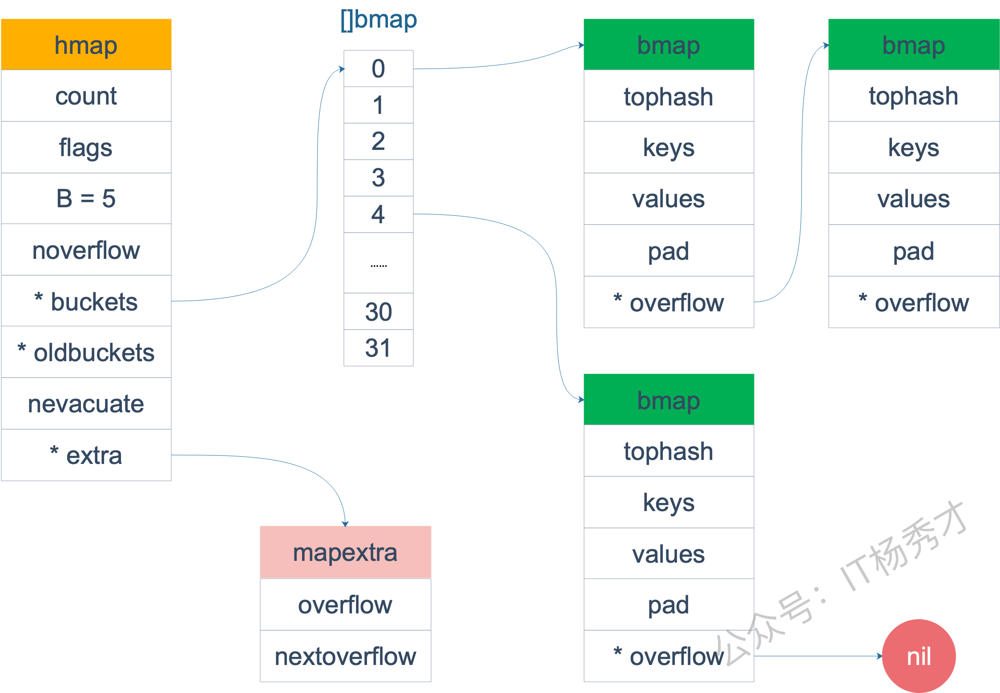

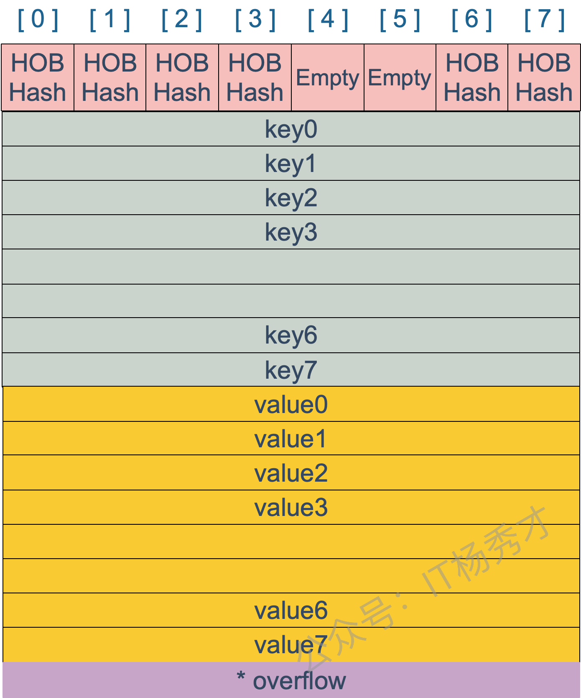

### 3.2 Go Map 的遍历是有序的还是无序的？

Go Map 的遍历是 **完全随机** 的，没有固定的顺序。map 每次遍历，都会从一个随机值序号的桶，在每个桶中，再从按照之前选定随机槽位开始遍历，所以是无序的

这意味着当使用 for range 遍历一个 Map 时，每次运行得到的元素顺序可能都不一样，甚至在同一个程序运行时多次遍历同一个 Map，顺序也可能不同

但是使用 fmt.Println 打印 Map 时，元素顺序是固定的，因为 fmt.Println 会按照键的哈希值升序排序输出

同时要注意，Map 的值不可寻址，这是为了避免一些并发访问的错误。Go 的 Map 不是线程安全的。当直接通过指针操作 Map 中的值时，可能会遇到数据竞争问题

### 3.4 Map 如何实现顺序读取？

如果业务上确实需要有序遍历，最规范的做法就是将 Map 的键 (Key) 取出来放入一个切片 (Slice) 中，用 sort 包对切片进行排序，然后根据这个有序的切片去遍历 Map

```go
package main

import (
   "fmt"
   "sort"
)

func main() {
   keyList := make([]int, 0)
   m := map[int]int{
      3: 200,
      4: 200,
      1: 100,
      8: 800,
      5: 500,
      2: 200,
   }
   for key := range m {
      keyList = append(keyList, key)
   }
   sort.Ints(keyList)
   for _, key := range keyList {
      fmt.Println(key, m[key])
   }
}
```

### 3.5 Go Map 是否是并发安全的？

Go Map 不是并发安全的，并发读写 Map 会导致数据竞争和不一致的结果。如果需要在并发场景下使用 Map，需要使用 sync.Map 或者其他并发安全的 Map 实现

### 3.7 Go Map 的扩容时机是怎样的？

向 map 插入新 key 时，会进行条件检测，符合以下两个条件，就会触发扩容

- 装载因子 (元素个数与桶数的比值) 超过阈值，源码中定义的阈值是 6.5，此时会触发双倍扩容，即 B+1，桶数会增加一倍
- overflow 的 bucket 数量过多
  - 当 B < 15 时，overflow bucket 数量超过 2^B
  - 当 B >= 15 时，overflow bucket 数量超过 2^15

这两种情况下会触发等量扩容，B 不变，创建一组新 bucket (数量和原来一样)，将原有的元素搬迁到新 bucket 中

### 3.8 Go Map 的扩容过程是怎样的？

Go Map 的扩容是 **渐进式** 的 (gradual)，首先分配新空间，然后在后续的每一次插入、修改或删除操作时，才会顺便搬迁一两个旧桶的数据

如果是触发双倍扩容，会新建一个 buckets 数组，新的 buckets 数量大小是原来的 2 倍，然后旧 buckets 数据搬迁到新的 buckets。如果是等量扩容，buckets 数量维持不变，重新做一遍类似双倍扩容的搬迁动作，把松散的键值对重新排列一次，使得同一个 bucket 中的 key 排列地更紧密，这样节省空间，存取效率更高

### 3.9 可以对 Map 的元素取地址吗？

无法对 map 的 key 或 value 进行取址，会发生编译报错，这样设计主要是因为 map 一旦发生扩容，key 和 value 的位置就会改变，之前保存的地址也就失效了

### 3.10 Map 中删除一个 key，它的内存会释放吗？

delete 一个 key，并不会立即释放或收缩 Map 占用的内存，具体来说，delete(m, key) 只是把 key 和 value 对应的内存块标记为 "空闲"，让它们的内容可以被后续的 GC 处理掉。但是，Map 底层为了存储这些键值对二分配的 "桶" 数组，它的规模时不会缩小的，只有在置空这个 map 的时候，整个 map 的空间才会被垃圾回收释放

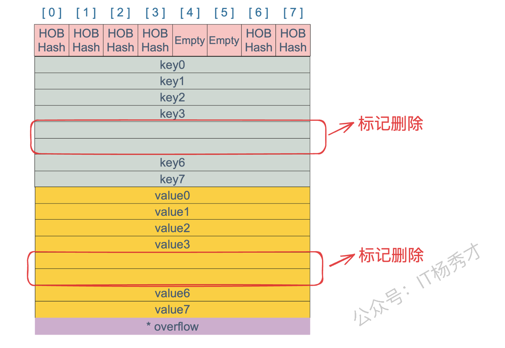

## 4. Channel 面试题

### 4.1 什么是 CSP？

CSP (Communicating Sequential Processes，通信顺序进程) 并发编程模型，它的核心思想是：通过通信共享内存，而不是通过共享内存来通信。Go 语言的 Goroutine 和 Channel 机制，就是 CSP 的经典实现，具有以下特点：

- 避免共享内存：协程 (Goroutine) 不直接修改变量，而是通过 Channel 通信
- 天然同步：Channel 的发送 / 接受自带同步机制，无需手动加锁
- 易于组合：Channel 可以嵌套使用，构建复杂并发模式 (如管道、超时控制)

### 4.2 Channel 的底层实现原理是怎样的？

Channel 的底层是一个名为 `hchan` 的结构体，核心包含几个关键组件：

- `环形缓冲区`：有缓冲 channel 内部维护一个固定大小的环形队列，用 buf 指针指向缓冲区，sendx 和 recvx 分别记录发送和接收的位置索引
- `两个等待队列`：sendq 和 recvq 用来管理阻塞的 goroutine。sendq 存储因 channel 满而阻塞的发送者，recvq 存储因 channel 空而阻塞的接收者。这些队列用双向链表实现，当条件满足时会唤醒对应的 goroutine
- `互斥锁`：hchan 内部有一个 mutex，所有的发送、接收操作都需要先获取锁，用来保证并发安全

```go
type hchan struct {
  // 以下五个字段组成了一个环形缓冲队列
  qcount   uint           // 队列中元素的数量
  dataqsiz uint           // 环形队列的长度
  buf      unsafe.Pointer // 指向环形队列的指针
  elemsize uint16         // 每个元素的大小
  elemtype *_type         // 元素的类型
  // 以下四个字段组成了两个链表
  sendx    uint           // 发送索引
  recvx    uint           // 接收索引
  recvq    waitq          // 接收等待队列，等待接收的 goroutine 队列
  sendq    waitq          // 发送等待队列，等待发送的 goroutine 队列

  closed   uint32         // 通道是否关闭
  lock     mutex          // 互斥锁
}
```

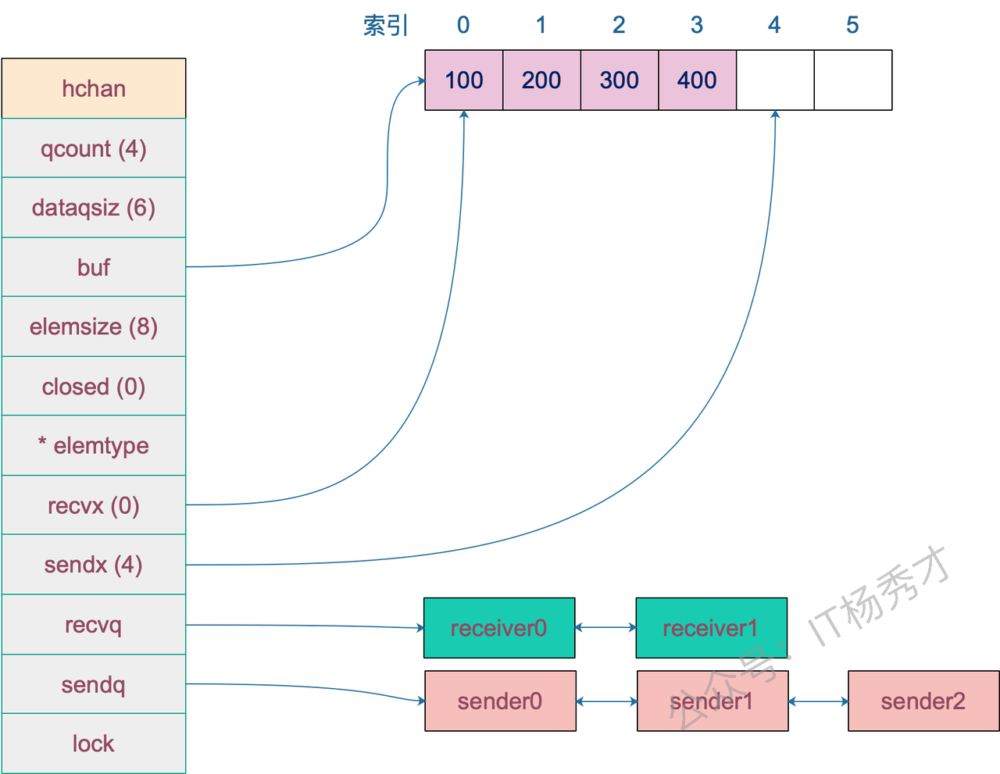

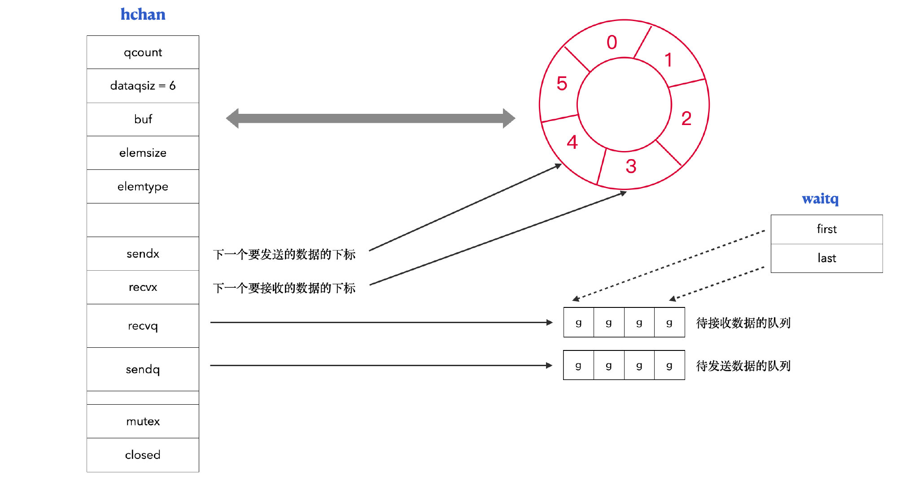

### 4.3 向 channel 发送数据的过程是怎样的？

向 channel 发送数据的整个过程都会在 mutex 保护下进行，保证并发安全

1. 首先检查是否有等待的接收者，如果 recvq 队列非空，说明有 goroutine 在等待接收数据，这时会直接把数据传递给等待的接收者，跳过缓冲区。同时会唤醒对应的 goroutine 继续执行
2. 如果没有等待的接收者，就尝试写入缓冲区。检查缓冲区是否还有空间，如果 qcount < dataqsize，就把数据复制到 buf[sendx]，然后更新 sendx 索引和 qcount 计数
3. 当缓冲区满了就需要阻塞等待。创建一个 sudog (pseudo goroutine) 结构体包装当前 goroutine 和要发送的数据，加入到 sendq 等待队列中，然后调用 gopark 让当前 goroutine 进入阻塞状态，让出 CPU 给其他 goroutine

被唤醒后继续执行。当有接收者从 channel 读取数据后，会从 sendq 中唤醒一个等待的发送者，被唤醒的 goroutine 会完成数据发送并继续执行

有两个 receiver 在 channel 的一边虎视眈眈地等着，这时 channel 另一边来了一个 sender 准备向 channel 发送数据，为了高效，用不着通过 channel 的 buf "中转"一次，直接从源地址把数据 copy 到目的地址就可以了，效率高啊！

### 4.4 从 channel 读取数据的过程是怎样的？

1. 首先检查是否有等待的发送者，如果 sendq 队列非空，说明有 goroutine 在等待发送数据。对于无缓冲 channel，会直接从发送者那里接收数据；对于有缓冲 channel，会先从缓冲区读取数据，然后把等待的发送者的数据放入缓冲区，这样保持 FIFO 顺序
2. 如果没有等待发送者，尝试从缓冲区读取，检查 qcount > 0，如果缓冲区有数据，就从 buf[recvx] 位置取出数据，然后更新 recvx 索引和 qcount 计数。这是缓冲区有数据时的正常路径

缓冲区为空时需要阻塞等待，创建 sudog 结构体包装当前 goroutine，加入到 recvq 等待队列，调用 gopark 进入阻塞状态，当有发送者写入数据时会被唤醒继续执行

从已关闭的 channel 读取时有特殊处理，如果 channel 已关闭且缓冲区为空，会返回零值和 false 标志；如果缓冲区还有数据，可以正常读取直到清空。这就是为什么 v, ok := <-ch 会返回两个值，第一个是 channel 中的数据，第二个是一个布尔值，表示 channel 是否已关闭

### 4.6 Channel 在什么情况下会引起内存泄漏？

Channel 引起内存泄漏最常见的是引起 goroutine 泄漏从而导致的间接内存泄漏，当 goroutine 阻塞在 channel 操作上永远无法退出时，goroutine 本身和它引用的变量都无法被 GC 回收。例如当一个 goroutine 在等待接收数据，但发送者已经退出了，这个接收者就会永远阻塞下去。或者 select 语句使用不当，在没有 default 分支的 select 中，如果所有 case 都无法执行，goroutine 会永远阻塞，出现内存泄漏

### 4.7 关闭 channel 会产生异常吗？

试图重复关闭一个 channel、关闭一个 nil 值的 channel、关闭一个只有接收方向的 channel 都将导致 panic 异常

### 4.9 什么是 select？

select 是 Go 专门为 channel 操作设计的多路复用控制结构，类似于网络编程中的 select 系统调用

核心作用是同时监听多个 channel 操作，当有多个 channel 都可能有数据收发时，select 能够选择其中一个可执行的 case 进行操作，而不是按顺序逐个尝试。例如同时监听数据输入、超时信号、取消信号等

### 4.10 select 的执行机制是怎样的？

select 的执行机制是随机选择，如果多个 case 同时满足条件，Go 会随机选择一个执行，这避免了饥饿问题，如果没有 case 能执行就会执行 default，当前 goroutine 会阻塞等待

### 4.11 select 的实现原理是怎样的？

Go 实现 select 时，定义了一个数据结构 scase，表示每个 case 语句 (包含 default)，scase 结构包含 channel 指针、操作类型等信息，select 操作的整个过程通过 selectgo 函数在 runtime 层面实现

Go 运行时会将所有 case 进行随机排序，这是为了避免饥饿问题。然后执行两轮扫描策略：第一轮直接检查每个 channel 是否可读写，如果找到就绪的立即执行；如果都没就绪，第二轮就把当前 goroutine 加入到所有 channel 的发送或接收队列中，然后调用 gopark 进入睡眠状态，使当前 goroutine 让出 CPU

当某个 channel 变为可操作时，调度器会唤醒对应的 goroutine，此时需要从其他 channel 的等待队列中清理掉这个 goroutine，然后执行对应的 case 分支

核心原理：case 随机化 + 双重循环检测

```go
type scase struct {
    c *hchan // 关联的 channel 指针
    elem unsafe.Pointer // 数据元素指针，用于存储接收或发送的数据
    kind uint16 // case 类型：caseNil, caseRecv, caseSend, caseDefault
    pc uintptr // 程序计数器，用于调试
    releasetime int64 // 释放时间，用于竞态检测
}
```


在默认的情况下，select 语句会在编译阶段经过如下过程的处理：

1. 将所有的 case 转换成包含 Channel 以及类型等信息的 scase 结构体；
2. 调用运行时函数 selectgo 获取被选择的 scase 结构体索引，如果当前的 scase 是一个接收数据的操作，还会返回一个指示当前 case 是否是接收的布尔值；
3. 通过 for 循环生成一组 if 语句，在语句中判断自己是不是被选中的 case。

## 5. Sync 面试题

### 5.1 除了 mutex 以外还有哪些方式安全读写共享变量？

除了 mutex，主要还有信号量、通道 (channel)、原子操作 (atomic) 这几种方式

信号量的实现跟 mutex 差不多，实现起来比较方便，主要通过信号量计数来保证。channel 是 Go 最推崇的方式，它通过通信来传递数据所有权，从根源上避免竞争，更适合复杂的业务逻辑；而原子操作则针对最简单的整型或指针等进行无锁操作，性能最高，常用于实现计数器或状态位。选择哪种，完全取决于数据结构等复杂度和业务的读写模型

### 5.2 Go 语言是如何实现原子操作的？

Go 实现原子操作，其根本是依赖底层 CPU 硬件提供的原子指令，而不是通过操作系统或更上层的锁机制

### 5.3 聊聊原子操作和锁的区别

原子操作和锁的最核心区别在于它们的 **实现层级** 和 **保护范围**

原子操作是 CPU 硬件层面的 “微观” 机制，它保证对单个数据 (通常是整型或指针) 的单次读改写操作是绝对不可分割的，性能极高，因为他不涉及操作系统内核的介入和 goroutine 的挂起

锁则是操作系统或语言运行时提供的 “宏观” 机制，它保护的是一个代码块 (临界区)，而不仅仅是单个变量。当获取锁失败时，它会让 goroutine 休眠，而不是空耗 CPU。虽然锁的开销远大于原子操作，但它能保护一段复杂的、涉及多个变量的业务逻辑

因此，对于简单的计数器或标志位更新，用原子操作追求极致性能；而一旦需要保护一段逻辑或多个变量的一致性，就必须用锁

### 5.4 Go 互斥锁 mutex 底层是如何实现的？

mutex 底层是通过原子操作加信号量实现的，通过 atomic 包中的一些原子操作来实现锁的锁定，通过信号量来实现协程的阻塞与唤醒

```go
type Mutex struct {
  // state 表示锁的状态，有锁定、被唤醒、饥饿模式等，并且是用 state 的二进制位来标识的，不同模式下会有不同的处理方式
  state int32
  // sema 表示信号量，mutex 阻塞队列的定位是通过这个变量来实现的，从而实现 goroutine 的阻塞和唤醒
  sema uint32
}
```

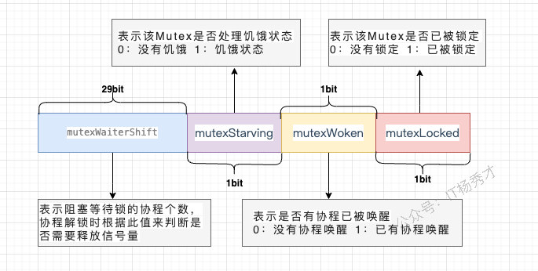

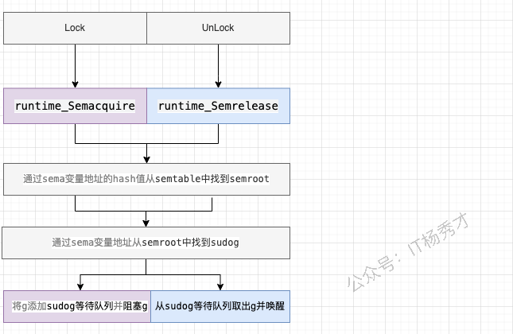

### 5.5 Mutex 有几种模式？

两种模式：正常模式 (Normal Mode) 和饥饿模式 (Starvation Mode)

- 正常模式：这是默认模式，讲究的是性能。新请求锁的 goroutine 会和等待队列头部的 goroutine 竞争，新来的 goroutine 会有几次 “自旋” 的机会，如果在此期间锁被释放，它就可以直接抢到锁。这种方式吞吐量最高，但可能会导致队列头部的 goroutine 等待很久，即不公平
- 饥饿模式：当一个 goroutine 在等待队列中等待超过 1ms 后，Mutex 就会切换到此模式，讲究的是公平。在此模式下，锁的所有权会直接从解锁的 goroutine 移交给等待队列的头部，新来的 goroutine 不会自旋，必须排到队尾。这样可以确保队列中的等待者不会被 “饿死”

当等待队列为空，或者一个 goroutine 拿到锁时发现它的等待时间小于 1ms，饥饿模式就会结束，切换回正常模式。这两种模式的动态切换，是 Go 在性能和公平性之间做的精妙平衡

### 5.6 在 Mutex 上自旋的 goroutine 会占用太多资源吗

不会，因为 Go 的自旋设计得非常克制和智能

首先，自旋不是无休止的空转，它有严格的次数和时间限制，通常只持续几十纳秒。其次，自旋仅仅在特定条件下才会发生，比如 CPU 核数大于 1，并且当前机器不算繁忙 (没有太多 goroutine 在排队)。它是在赌，与其付出 "goroutine 挂起和唤醒" 这种涉及内核调度的巨大代价，不如原地 “稍等一下”，因为锁可能马上就释放了

所以，这种自旋是一种机会主义的短线优化，目的是用极小的 CPU 开销去避免一次昂贵的上下文切换，在锁竞争不激烈、占用时间极短的场景下，它反而是节省了资源

### 5.8 sync.Once 的作用是什么，讲讲它的底层实现原理

sync.Once 的作用是确保一个函数在程序生命周期内，无论在多少个 goroutine 中被调用，都只会被执行一次。它通常用于单例对象的初始化或一些只需要执行一次的全局配置加载

sync.Once 保证代码段只执行 1 次的原理主要是其内部维护了一个标识位，当它 == 0 时表示还没执行过函数，此时会加锁修改标识位，然后执行对应函数。后续再执行时发现标识位 != 0，则不会再执行后续动作了

```go
type Once struct {
  done uint32
  // m 是一个互斥锁，用于保护 done 标识位的读写操作
  m Mutex
}
```

当 Once.Do(f) 首次被调用时：

1. 首先会通过原子操作 (atomic.LoadUint32) 检查 done 标志位，如果是 1，说明初始化已完成，直接返回，这个路径完全无锁，开销极小
2. 如果 done 是 0，说明是第一次调用，这时它会进入一个慢路径 (doSlow)
3. 在慢路径中，它会先加锁，然后再次检查 done 标志位。这个双重检查 (Double-Checked Locking) 是关键，它防止了在多个 goroutine 同时进入慢路径时，函数 f 被重复执行
4. 如果此时 done 仍然为 0，那么当前 goroutine 就会执行传入的函数 f。执行完毕后，它会通过原子操作 (atomic.StoreUint32) 将 done 标志位置为 1，最后解锁

之后任何再调用 Do 的 goroutine，都会在第一步的原子 Load 操作时发现 done 为 1 而直接返回。整个过程结合了原子操作的速度和互斥锁的安全性，高效且线程安全地实现了 “仅执行一次” 的保证

### 5.9 WaitGroup 是如何实现协程等待的？

WaitGroup 实现等待，本质上是一个原子计数器和一个信号量的协作

调用 Add 会增加计数值，Done 会减少计数值。而 Wait() 方法会检查这个计数器，如果不为 0，就利用信号量将当前 goroutine 高效地挂起，直到最后一个 Done 调用将计数器清零，它就会通过这个信号量，一次性唤醒所有在 Wait 处等待的 goroutine，从而实现等待目的

```go
type WaitGroup struct {
  // 这是一个特殊的字段，用于静态分析工具 (go vet) 在编译时检查 WaitGroup 实例是否被复制。WaitGroup 被复制后会导致状态不一致，可能引发程序错误，因此该字段的存在旨在防止此类问题的发生
  noCopy noCopy
  // WaitGroup 的核心，一个 64 位的无符号整型，通过 sync/atomic 包进行原子操作，以保证并发安全。这个 64 位的空间被分为两部分
  // 高 32 位作为计数器，记录了需要等待的 goroutine 的数量
  // 低 32 位作为等待者计数器，记录了调用 Wait() 方法后被阻塞的 goroutine 的数量
  state atomic.Uint64
  // 一个信号量，用于实现 goroutine 的阻塞和唤醒，当主 goroutine 调用 Wait() 方法且计数器不为 0 时，它会通过这个信号量进入休眠状态。当所有子 goroutine 完成任务后，会通过这个信号量来唤醒等待的主 goroutine
  sema  uint32
}
```

### 5.10 讲讲 sync.Map 的底层实现原理

sync.Map 的底层核心是 “空间换时间”，通过两个 Map (read 和 dirty) 的冗余结构，实现 “读写分离”，最终达到针对特定场景的 “读” 操作无锁优化

read 是一个只读的 map，提供无锁的并发读取，速度极快。写操作则会先操作一个加了锁的、可读写的 dirty map。当 dirty map 的数据积累到一定程度，或者 read map 中没有某个 key 时，sync.Map 会将 dirty map 里的数据 “晋升” 并覆盖掉旧的 read map，完成一次数据同步

```go
type Map struct {
  // 用于保护 dirty map 的锁
  mu Mutex
  // 只读字段，其实际的数据类型是一个 readOnly 结构
  read atomic.Value
  // 需要加锁才能访问的 map，其中包含在 read 中除了被 expunged(删除) 以外的所有元素以及新加入的元素
  dirty map[interface{}]*entry
  // 计数器，记录从 read 中读取数据的时候，没有命中的次数，当 misses 值等于 dirty 长度时，dirty 提升为 read
  misses int
}

// readOnly is an immutable struct stored atomically in the Map.read field.
type readOnly struct {
  // key 为任意可比较的类型，value 为 entry 指针
  m map[interface{}]*entry

  // amended = true 表示 read map 的数据已经不全了，可能需要到 dirty map 中去查询，以获取最新的数据信息
  amended bool
}

type entry struct {
  // p 指向真正的 value 所在的地址
  p unsafe.Pointer
}
```

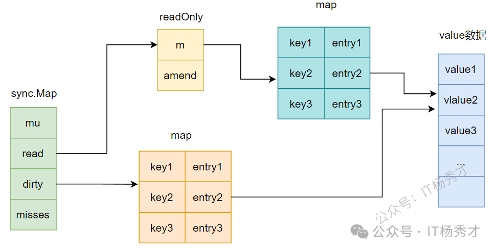

read map 是 dirty map 的一个不完全、且可能是过期的只读快照，dirty map 则包含了所有的最新数据

具体来说，read map 中的所有数据，在 dirty map 里一定存在。一个 key 如果在 read map 里，那它的 value 要么是最终值，要么就是一个特殊指针，指向 dirty map 中的对应 entry。而 dirty map 中有的 key，在 read map 中不一定存在，因为 dirty map 是最新的、最全的

当 dirty map 积累了足够多的新数据后，它会 “晋升” 为新的 read map，旧的 read map 则被废弃

### 5.12 为什么要设计 nil 和 expunged 两种删除状态？

为了解决在 sync.Map 的 “读写分离” 架构下，如何高效、无锁地处理 “删除” 操作

sync.Map 采用 nil 和 expunged 两种状态，是为了在读写分离架构下，既能实现无锁的高效逻辑删除，又能保证 dirty map 重建时的内存回收与数据一致性

nil (逻辑删除状态)：当用户调用 Delete 时，如果在 read map 中找到该 key，会通过无锁 cAS 操作将其值设为 nil。这避免了加锁和修改底层 map 结构。如果以后该 key 再次被 Store 写入，可以直接无锁更新

expunged (物理剔除标记)：当 read map 需要全量复制数据构建新的 dirty map 时，为了避免把已删除的 key 也复制过去导致内存泄漏，系统会将 read 中为 nil 的 key 标记为 expunged，并跳过复制

两者核心的区别在于对 Store 操作的指导意义：看到 nil，说明该 key 仍在 dirty 中 (或尚未有新 dirty)，可以直接无锁更新。看到 expunged，说明该 key 已经不在 dirty 中了，必须加锁将其重新插入 dirty map，以防止后续 dirty 晋升时导致最新写入的数据丢失

简单来说，这两个状态就像是在只读的 read map 上打的 “逻辑删除” 补丁。它避免了因为一次 Delete 操作就引发加锁和 map 的整体复制，把真正的物理删除延迟到了 dirty map “晋升” 为 read map 的那一刻，是典型的用状态标记来换取无锁性能的设计

### 5.13 sync.Map 适用的场景

sync.Map 适合读多写少的场景

因为期望将更多的流量在 read map 这一层进行拦截，从而避免加锁访问 dirty map。对于更新、删除、读取，read map 可以尽量通过一些原子操作，让整个操作变得无锁化，这样就可以避免进一步加锁访问 dirty map。

### 5.14 sync.Cond 是什么？有什么用？

`sync.Cond` 是 Go 标准库中实现的 **条件变量 (Condition Variable)**，它是一种并发原语，用于协调多个 goroutine 之间的等待与通知关系。其核心思想是：让 goroutine 在某个条件不满足时进入休眠等待，当条件满足时被其他 goroutine 唤醒继续执行，从而避免无效的忙 (busy-waiting) 等待消耗 CPU 资源。

底层数据结构

```go
type Cond struct {
    noCopy  noCopy        // 防止 Cond 被复制 (编译期检查)
    L       Locker        // 与条件变量关联的锁 (通常是 *sync.Mutex 或 *sync.RWMutex)
    notify  notifyList    // 等待通知的 goroutine 队列 (内部维护等待链表)
    checker copyChecker   // 运行期防止复制检查
}

// notifyList 是内部等待队列的实现
type notifyList struct {
    wait   uint32  // 下一个等待者的 ticket 编号
    notify uint32  // 下一个被通知的 ticket 编号
    lock   uintptr // 内部锁
    head   unsafe.Pointer // 等待队列头
    tail   unsafe.Pointer // 等待队列尾
}
```

#### 核心 API

- `sync.NewCond(l Locker) *Cond`: 创建一个与锁 `l` 绑定的条件变量
- `(*Cond).Wait()`: **释放锁** 并挂起当前 goroutine，被唤醒后的 **重新获取锁** 再返回
- `(*Cond).Signal()`: 唤醒一个正在等待的 goroutine
- `(*Cond).Broadcast()`: 唤醒所有正在等待的 goroutine

Wait() 的原子性原理

`Wait()` 内部做了三件事，并且保证原子性

```plaintext
1. 将当前 goroutine 加入等待队列
2. 释放 c.L 锁  ──┐ 这两步是原子的，避免在"释放锁"和
3. 挂起 goroutine ──┘ "进入等待"之间发生条件变化导致通知丢失
--- 被唤醒后 ---
4. 重新获取 c.L 锁
5. 返回给调用方
```

#### 使用模板

##### 等待方 (Wait)

```go
// ⚠️ 必须在持有锁的情况下调用 Wait()
c.L.Lock()

// ⚠️ 必须用 for 循环而不是 if，防止虚假唤醒(spurious wakeup)
// 以及多个 goroutine 被 Broadcast 唤醒后条件可能已被其他 goroutine 消费
for !condition() {
    c.Wait() // 内部会释放锁 -> 挂起 -> 重新获取锁
}
// 此时条件满足，执行业务逻辑
doSomething()

c.L.Unlock()
```

##### 通知方 (Signal / Broadcast)

```go
c.L.Lock()
// 修改条件状态
changeCondition()
c.L.Unlock()

c.Signal()    // 唤醒一个等待者
// 或
c.Broadcast() // 唤醒所有等待者
```

Go 哲学：优先使用 Channel，但当需要广播通知或等待的条件本身很复杂时，`sync.Cond` 更合适。

知识扩展

- Go 调度器 (GMP 模型): `Wait()` 挂起 goroutine 的本质是让调度器将该 goroutine 从运行队列中移除，`Signal()/BroadCast()` 的本质是将 goroutine 重新放入运行队列。

## 6. Context 面试题

### 6.1 Go 语言中的 Context 是什么？

Context 实际上是一个接口，提供了 Deadline(), Done(), Err(), Value() 四个方法

本质上是一个 **信号传递和范围控制的工具**。它的核心作用是在一个请求处理链路中 (跨越多个函数和 goroutine) 优雅地传递取消信号 (cancellation)、超时 (timeout) 和截止日期 (deadline)，并能携带一些范围内的键值对数据

```go
type Context struct {
  // Deadline() 的第一个返回值表示还有多久到期，第二个返回值代表是否被超时时间控制
  Deadline() (deadline time.Time, ok bool)
  // Done() 返回一个只读的 channel，当 Context 被取消或超时，这个 channel 会被关闭，这是 goroutine 监听取消信号的核心
  Done() <-chan struct{}
  // Err() 返回一个错误，表示 Context 被取消的原因，或者 nil 如果 Context 没有被取消
  Err() error
  // Value() 方法用于在 Context 范围内传递键值对数据，它返回与 key 关联的值，或者 nil 如果没有找到
  Value(key interface{}) interface{}
}
```

### 6.2 Go 语言的 Context 有什么作用？

Context 主要解决三个核心问题：超时控制、取消信号传播和请求级数据传递

在实际项目中，最常用的是超时控制。例如一个 HTTP 请求需要调用多个下游服务，通过 context.WithTimeout 设置整体超时时间，当超时发生时，所有子操作都会收到取消信号并立即退出，避免资源浪费。取消信号的传播是通过 Context 的层级结构实现的，父 Context 取消时，所有子 Context 都会自动取消

另外 Context 还能传递请求级的元数据，例如用户 ID、请求 ID 等，这在分布式链路追踪中特别有用。需要注意的是，Context 应该作为函数的第一个参数传递，不要存储在结构体中，并且传递的数据应该是请求级别的，不要滥用

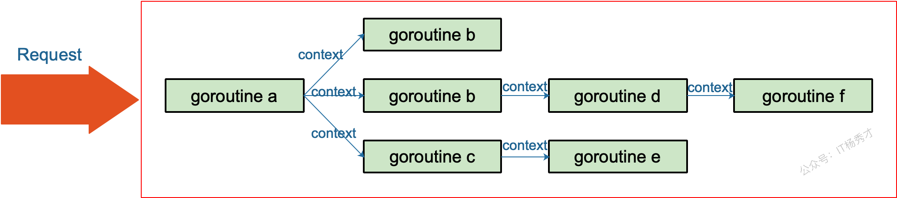

### 6.3 Context.Value 的查找过程是怎样的？

Context.Value 的查找过程是一个链式递归查找的过程，从当前 Context 开始，沿着父 Context 链一直向上查找直到找到对应的 key 或者到达根 Context

具体流程是：当调用 context.Value(key) 时，首先检查当前 Context 是否包含这个 key，如果当前层没有，就回调用 parent.Value(Key) 继续向上查找。这个过程会一直递归下去，直到找到匹配的 key 返回对应的 value，或者查找到根 Context 返回 nil

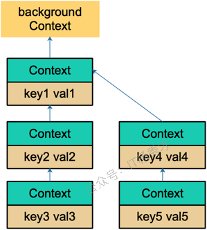

### 6.4 Context 如何被取消？

Context 的取消是通过 `channel 关闭信号` 实现的，主要有三种取消方式

- 主动取消，通过 Context.WithCancel 创建的 Context 会返回一个 cancel 函数，调用这个函数就会关闭内部的 done channel，所有监听这个 Context 的 goroutine 都能通过 Context.Done() 收到取消信号
- 超时取消，Context.WithTimeout 和 Context.WithDeadline 会启动一个定时器，到达指定时间后自动调用 cancel 函数触发取消
- 级联取消，当父 Context 被取消时，所有子 Context 会自动被取消，这是通过 Context 树的结构实现的

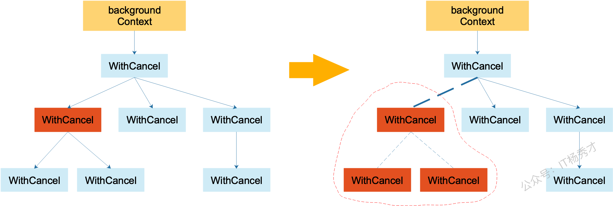

## 7. Interface 面试题

Go 的 Interface 是一种 “行为约束”：只要一个类型实现了接口的方法集合，它就自动实现该接口

### 7.1 Go 语言中，Interface 的底层原理是怎样的？

Go 的 Interface 底层有两种数据结构：eface 和 iface

eface 是空 interface{} 的实现，只包含两个指针：`_type` 指向类型信息，`data` 指向实际数据，这就是为什么空接口能存储任意类型值的原因，通过类型指针来标识具体类型，通过数据指针来访问实际值

iface 是带方法的 interface 实现，包含 `itab` 和 `data` 两个部分，itab 是核心，它存储了接口类型、具体类型以及方法表。方法表是函数指针数组，保存了该类型实现的所有接口方法的地址

```go
type eface struct {
  _type *_type
  data unsafe.Pointer
}
```


```go
// iface = (我现在装的是哪种具体类型 + 它如何实现该接口的方法表， 以及 具体数据在哪里)
type iface struct {
  tab *itab
  data unsafe.Pointer
}

type itab struct {
  inter *interfacetype // 接口类型信息指针
  _type *_type         // 具体类型信息指针
  hash uint32          // 哈希值，用于快速比较
  _ [4]byte            // 填充，确保对齐
  fun [1]uintptr       // 方法表，存储具体类型实现的所有接口方法的函数指针
}
```

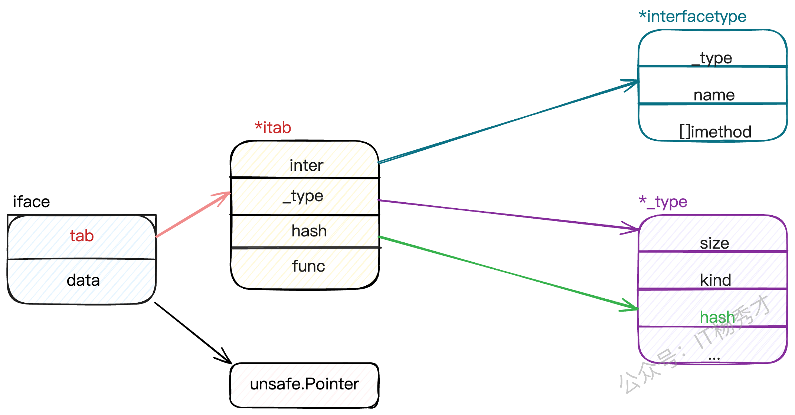

### 7.2 iface 和 eface 的区别是什么？

核心区别在于是否包含方法信息

eface 是空接口 interface{} 的底层实现，结构非常简单，只有两个字段：_type 指向类型信息，data 指向实际数据。因为空接口没有方法约束，所以不需要存储方法相关信息

iface 是非空接口的底层实现，结构相对复杂，包含 itab 和 data。关键是 itab，它不仅包含类型信息，还包含一个方法表，存储着该类型实现的所有接口方法的函数指针

### 7.3 类型转换和断言的区别是什么？

类型转换、类型断言本质上都是把一个类型转换成另一个类型。不同之处在于，类型断言是对接口变量进行的操作。对于类型转换而言，类型转换是在编译期确定的强制转换，转换前后的两个类型要相互兼容才行，语法是 T(value)，而类型断言是运行期的动态检查，专门用于从接口类型中提取具体类型，语法是 value.(T)

- 安全性差别很大：类型转换在编译期保证安全性，而类型断言可能在运行时失败。所以实际开发中更常用安全版本的类型断言 value, ok := x.(string)，通过 ok 判断是否成功
- 使用场景不同：理想转换主要解决数值类型、字符串、切片等之间的转换问题；类型断言主要用于接口编程，当拿到一个 interface{} 需要还原成具体类型使用
- 底层实现不同：类型转换通常是简单的内存重新解释或者数据格式调整；类型断言需要检查接口的底层类型信息，涉及 runtime 的类型系统

### 7.4 Go 语言 Interface 有哪些使用场景

- 依赖注入和解耦：通过定义接口抽象，让高层模块不依赖具体实现，比如定义一个 UserRepo 接口，具体可以是 MySQL、Redis 或 Mock 实现，这样代码更容易测试和维护，也符合 SOLID 原则
- 多态实现：比如定义一个 Shape 接口包含 Area() 方法，不同的图形结构体实现这个接口，就能用统一的方式处理各种图形。这让代码更加灵活和可扩展
- 标准库中大量使用 Interface 来体统统一 API：像 io.Reader、io.Writer 让文件、网络连接、字符串等都能用统一的方式操作；sort.Interface 让任意类型都能使用标准库的排序算法。
- 类型断言和反射的配合使用：比如 JSON 解析、ORM 映射等场景，先用 interface{} 接收任意类型，再通过类型断言或反射处理具体逻辑。
- 插件化架构

### 7.5 接口之间可以相互比较吗？

- 接口值之间可以通过 == 和 != 进行比较。两个接口值相等仅当它们都是 nil 值，或者它们的动态类型相同并且动态值也根据这个动态类型的 == 操作相等。如果两个接口值的动态类型相同，但是这个动态类型是不可比较的 (例如切片)，将它们进行比较就回失败且 panic
- 接口值在与非接口值比较时，Go 会先将非接口值尝试转换为接口值，再比较
- 接口值较为特别，其他类型要么是可比较类型 (如基本类型和指针)，要么是不可比较类型 (如切片、映射类型和函数)，但是接口值视具体的类型和值，可能会报出潜在的 panic

接口值的零值是指 `动态类型` 和 `动态值` 都为 nil，当且仅当这两部分的值都为 nil 时，这个接口值才会被认为 == nil

## 8. 反射面试题

### 8.1 什么是反射？

反射是指计算机程序在运行时 (runtime) 可以访问、检测和修改它本身状态或行为的一种能力。用比喻来说，反射就是程序在运行的时候能够 “观察” 并修改自己的行为

### 8.2 Go 如何实现反射？

Go 反射是通过接口来实现的，一个接口变量包含两个指针结构：一个指针指向类型信息，另一个指针指向实际的数据。当将一个具体类型的变量赋值给一个接口时，Go 就会把这个变量的类型信息和数据地址都存到这个接口变量中

有了这个前提，Go 就可以通过 reflect 包的 Type 和 ValueOf 这两个函数读取接口变量里的类型信息和数据信息。把这些内部信息 “解包” 成可供检查和操作的对象，完成在运行时对程序本身的动态访问和修改

### 8.3 Go 语言中的反射应用有哪些？

- JSON 序列化是最常见的应用，encoding/json 包通过反射动态获取结构体字段，实现任意类型的序列化和反序列化。这也是为什么能直接用 json.Marshal 处理各种自定义结构体的原因
- ORM 框架，例如 GORM 通过反射分析结构体字段，自动生成 SQL 语句和字段映射。它能动态读取 structtag 来确定数据库字段名、约束等信息，大大简化了数据库操作
- Web 框架的参数绑定也大量使用反射，例如 Gin 框架的 ShouldBind 方法，能够根据请求类型自动将 HTTP 参数绑定到结构体字段上，这背后就是通过反射实现的类型转换和赋值
- 还有配置文件解析、RPC 调用、测试框架等场景。例如 Viper 配置库用于反射将配置映射到结构体，gRPC 通过反射实现服务注册和放啊调用

### 8.4 如何比较两个对象完全相同？

最直接的是用 reflect.DeepEqual，这是标准库提供的深度比较函数，能够递归比较两个对象 (包括结构体、切片、map 等符合类型的所有字段和元素) 的所有字段是否相等。例如 reflect.DeepEqual(obj1, obj2)，它会逐层比较内部所有数据，包括指针指向的值

对于简单类型可以直接用 == 操作符，需要注意 slice、map、function 这些类型是不能直接用 == 比较的，会编译报错

实际项目中更推荐自定义 Equal 方法，根据业务需求定义相等的标准

## 9. GMP 面试题

### 9.1 Go 语言的 GMP 模型是什么？

GMP 是 Go 运行时的核心调度模型

GMP 含义：G 是 goroutine 协程；M 是 machine 系统线程，是真正干活的；P 是 processor，逻辑处理器，是 G 和 M 之间的桥梁，负责调度 G

- G: goroutine (待运行的任务)，表示一个 goroutine 以及它的运行现场 (栈、指令位置、状态等)，G 会处在 runnable/running/waiting 等状态，在需要时被调度执行
- M: 机器线程 (OS Thread)，真实的操作系统线程，负责执行 Go 代码，M 必须拿到一个 P 才能执行 Go 代码 (没有 P 的 M 只能阻塞/空转，或去做系统调用相关的事情)
- P: 处理器 (调度资源/执行上下文)，调度器的关键资源，决定 "并行度"，持有本地运行队列 (run queue)、全局运行队列、缓存等。P 的数量 = GOMAXPROCS (默认等于 CPU 核数)，表示同一时刻最多有多少个 goroutine 真正在 CPU 上并行跑 (不含阻塞在 syscall 的线程)

调度逻辑：M 必须绑定 P 才能执行 G，每个 P 维护一个自己的本地 G 队列 (长度 256)，M 从 P 的本地队列取 G 执行。当本地队列为空时，M 会按优先级从全局队列、网络轮询器、其他 P 队列中窃取 goroutine (大约一半)，这是 work stealing 机制

GMP 模型让 Go 能在少量线程上调度海量 goroutine，是 Go 高并发的基础

- 减少线程数量：大量 goroutine 复用少量 OS 线程，降低创建/切换成本
- 高并发 + 高吞吐：P 的本地队列与 work stealing 减少锁竞争并均衡负载
- 阻塞隔离：syscall 阻塞不至于拖垮整体并行度


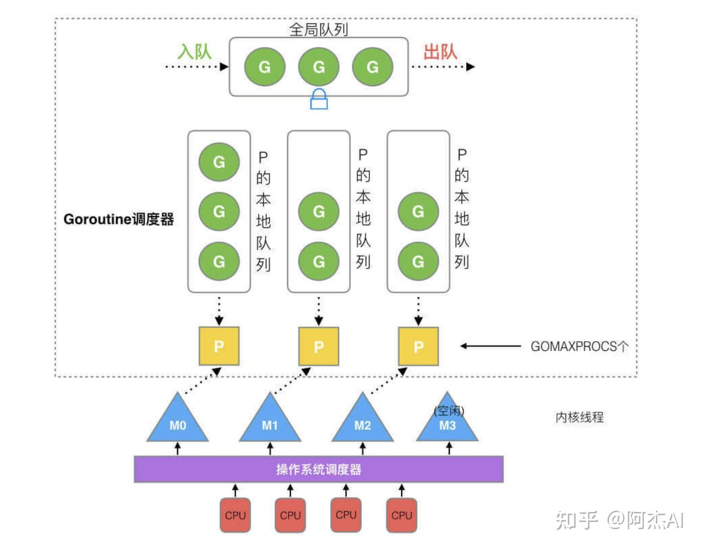

### 9.2 什么是 Go scheduler

GO scheduler 是 Go 运行时的 `协程调度器`，负责在系统线程上调度执行 goroutine，它是 Go runtime 的一部分，内嵌在 Go 程序中，和 GO 程序一起运行。主要工作是决定哪个 goroutine 在哪个线程上运行，以及何时进行上下文切换。scheduler 的核心是 schedule() 函数，它在无限循环中寻找可运行的 goroutine，当找到后通过 execute() 函数切换到 goroutine 执行，goroutine 主动让出或被抢占时再回到调度循环

### 9.3 Go 语言在进行 goroutine 调度时，调度策略是怎样的？

Go 语言采用的是抢占式调度策略。Go 会启动一个线程，一直运行着 sysmon 函数，sysmon 运行在 M 上，且不需要 P。当 sysmon 发现 M 已运行同一个 G 10ms 以上时，它会将该 G 当内部参数 preempt 设置为 true，表示需要被抢占，让出 GPU

Go 1.14 之后：调度策略基于信号的异步抢占机制，sysmon 会监测到运行了 10ms 以上的 G，然后 sysmon 向运行 G 的 M 发送信号 (SIGURG)。Go 的信号处理程序会调用 M 上的一个叫做 gsignal 的 goroutine 来处理该信号，并使其检查该信号。gsignal 看到抢占信号，停止正在运行的 G

### 9.4 发生调度的时机有哪些？

- 等待读取或写入未缓冲的通道
- 由于 time.Sleep() 而等待
- 等待互斥量释放
- 发生系统调用

### 9.5 M 寻找可运行 G 的过程是怎样的？

M 会优先检查本地队列 (LRQ)：从当前 P 的 LRQ 里 runqget 一个 G (无锁 CAS)。如果本地队列没有可运行的 G，再次检查全局队列 (GRQ)，去全局队列里 globrunqget 找 (需要加锁)。如果还没有，就检查网络轮询器 (netpoll)，就去 netpoll 里查看是否有因为网络 IO 就绪的 G (非阻塞模式)。如果依然没有，则会从别的 P (随机) 的 LRQ 里偷取一半 G (stealhalf)


### 9.6 GMP 能否去掉 P 层？如果去掉会怎样？

GMP 的 P 层理论上可以去掉，但会带来严重的性能问题

去掉 P 层的后果：如果直接变成 GM 模型，所有 M 都需要从全局队列中获取 goroutine，这就需要全局锁保护，在高并发场景下，大量 M 争抢同一把锁会造成严重的锁竞争，CPU 大部分时间都浪费在等待锁上，调度效率急剧下降

P 层的价值：P 的存在实现了无锁的本地调度。每个 P 维护独立的本地队列，M 绑定 P 后可以直接从本地队列取 G 执行，大部分情况下都不需要全局锁。只有本地队列空了才去头去，这大大减少了锁竞争

### 9.7 P 和 M 在什么时候会被创建？

P 的创建时机：P 在调度器初始化时一次性创建，在 schedinit() 函数中会调用 procresize()，根据 GOMAXPROCS 值创建对应数量的 P 对象，存储在全局 allp 数组中，之后 P 的数量基本固定，只有在调用 runtime.GOMAXPROCS() 动态调整时才会重新分配 P

M 的创建时机：M 采用 **按需创建** 策略，初始只有 m0 存在，当出现以下情况时会创建新的 M：

- 所有现有 M 都在执行阻塞的系统调用，但还有可运行的 G 需要执行
- 通过 startm() 函数发现没有空闲 M 可以绑定 P 执行 G
- M 的数量受 GOMAXTHREADS 限制，默认 10,000 个

创建流程：新 M 通过 newm() 函数创建，它会调用 newosproc() 创建新的系统线程，并为这个 M 分配独立的 g0。创建完成后，新 M 会进入 mstart() 开始调度循环

### 9.8 m0 是什么，有什么用？

m0 是在 Go 启动时创建的第一个 M，m0 对应程序启动时的主系统线程，它在 Go 程序的整个生命周期中都存在。与其他通过 runtime.newm() 动态创建的 M 不同，m0 是在程序初始化阶段静态分配的，有专门的全局变量存储

m0 主要负责执行 Go 程序的启动流程，包括调度器初始化、内存管理器初始化、垃圾回收器设置等。它会创建并运行第一个用户 goroutine 来执行 main.main 函数。在程序运行期间，m0 也参与正常的 goroutine 调度，和其他 M 没有本质区别。m0 在程序退出时还负责处理清理工作，比如等待其他 goroutine 结束、执行 defer 函数等


### 9.9 g0 是一个怎样的协程，有什么用？

g0 是一个特殊的 goroutine，不是普通的用户协程，而是 **调度协程**，每个 M 都有自己的 g0。它使用系统线程的原始栈空间，而不是像普通 goroutine 那样使用可增长的分段栈。g0 的栈大小通常是 8KB，比普通 goroutine 的 2KB 初始栈要大

核心作用：g0 专门负责 **执行调度逻辑**，包括 goroutine 的创建、销毁、调度决策等。当 M 需要进行调度时，会从当前运行的用户 goroutine 切换到 g0 上执行 schedule() 函数。g0 还负责处理垃圾回收、栈扫描、信号处理等运行时操作

运行机制：正常情况下 M 在用户 goroutine 上运行用户代码，当发生调度事件时 (如 goroutine 阻塞、抢占、系统调用返回等)，M 会切换到 g0 执行调度器代码，选出下一个要运行的 goroutine 后再切换过去

为什么需要 g0：因为调度器代码不能在普通 goroutine 的栈上执行，那样会有栈空间冲突和递归调度的问题。g0 提供了一个独立的执行环境，确保调度器能安全稳定地工作

### 9.10 g0 栈和用户栈是如何进行切换的？

g0 和用户 goroutine 之间的栈切换，本质是 **SP寄存器和栈指针的切换**。当用户 goroutine 需要调度时，通过 mcall() 函数切换到 g0。这个过程会保存当前用户 goroutine 的 PC、SP 等寄存器到其 gobuf 中，然后将 SP 指向 g0 的栈，PC 指向传入的调度函数。调度完成后，通过 gogo() 函数从 g0 切换回用户 goroutine，恢复其保存的寄存器状态

切换逻辑在汇编文件中实现，比如 runtime.mcall() 和 runtime.gogo()。这些函数直接操作 CPU 寄存器，确保切换的原子性和高效性。切换过程中会更新 g.sched 字段记录 goroutine 状态

goroutine 的结构如下

```go
// 位于 Go 源码路径: src/runtime/runtime2.go

// stack 描述了一个 Goroutine 的执行栈的边界
type stack struct {
  lo uintptr // 栈的最低地址
  hi uintptr // 栈的最高地址
}

// gobuf 描述了 Goroutine 的执行上下文（Context）
type gobuf struct {
  sp   uintptr // Stack Pointer：栈指针
  pc   uintptr // Program Counter：程序计数器（当前执行到哪行代码）
  g    guintptr // 指向所属的 goroutine
  ret  uintptr // 系统调用的返回值
  bp   uintptr // Base Pointer：基址指针（用于栈回溯）
}

// 核心：Goroutine 的化身 `g` 结构体
type g struct {
  // 1. 栈区管理 (Stack Management)
  stack       stack   // 当前 Goroutine 的可用栈范围 [lo, hi)
  stackguard0 uintptr // 栈溢出检查和抢占的标志（非常关键）
  stackguard1 uintptr // CGO 相关的栈检查标志

  // 2. 状态与归属 (Status & Ownership)
  m              *m      // 当前绑定在哪个 M（操作系统线程）上执行
  atomicstatus   uint32  // Goroutine 的当前状态（运行中、就绪、阻塞等）
  goid           int64   // Goroutine 的唯一 ID（类似线程 ID，但Go官方刻意隐藏了它）

  // 3. 上下文切换 (Context Switching)
  sched          gobuf   // 调度器保存和恢复 Goroutine 现场的地方

  // 4. 调度队列与阻塞 (Scheduling & Blocking)
  schedlink      guintptr   // 调度时用于将 g 串联成链表（例如在 RunQueue 中）
  waitsince      int64      // Goroutine 陷入阻塞的时间
  waitreason     waitReason // Goroutine 阻塞的原因（如：等待锁、网络I/O、channel等）

  // 5. 异常处理 (Panic & Defer)
  _panic         *_panic // 记录该 goroutine 最内层的 panic 结构体
  _defer         *_defer // 记录该 goroutine 挂载的 defer 链表

  // 6. 抢占标志 (Preemption)
  preempt        bool    // 抢占标记，若为 true，说明该 G 正在被请求让出 CPU
}
```

## 10. 内存管理面试题

### 10.1 讲讲 Go 语言是如何分配内存的

Go 语言的内存分配采用了 TCMalloc 算法的改进版本，核心是分级分配和本地缓存

分配器架构：Go 内存分配有三个层级：mcache(线程缓存)、mcentral(中央缓存)、mheap(页堆)。每个 P 都有独立的 mcache，避免了锁竞争；mcentral 按对象大小分类管理；mheap 负责从操作系统申请大块内存

对象分类分配：根据对象大小分为三类处理：

- 微小对象 (< 16字节)：在 mcache 的 tiny 分配器中分配，多个微小对象可以共享一个内存块
- 小对象 (16字节 - 32KB)：通过 size class 机制，预定义了 67 种大小规格，优先从 P 的 mcache 对应的 mspan 中分配，如果 mcache 没有内存，则从 mcentral 获取，如果 mcentral 也没有，则向 mheap 申请，如果 mheap 也没有，则从操作系统申请内存
- 大对象 (> 32KB)：直接从 mheap 分配，跨越多个页面

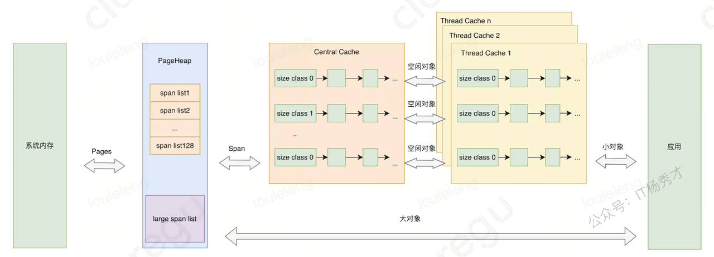

### 10.2 知道 golang 的内存逃逸吗？什么情况下会发生内存逃逸？

内存逃逸是编译器在程序编译时期根据逃逸分析策略，将原本应该分配到栈上的对象分配到堆上的一个过程

主要逃逸场景：

- 返回局部变量指针：函数返回内部变量的地址，变量必须逃逸到堆上
- interface{} 类型：传递给 interface{} 参数的具体类型会逃逸，因为需要运行时类型信息
- 闭包引用外部变量：被闭包捕获的变量会逃逸到堆上
- 切片/map 动态扩容：当容量超出编译期确定当范围时会逃逸
- 大对象：超过栈大小限制的对象直接分配到堆上

### 10.3 内存逃逸有什么影响？

因为堆对象需要垃圾回收机制来释放内存，栈对象会跟随函数结束时被编译器回收，所以大量的内存逃逸会给 GC 带来压力

### 10.4 Channel 是分配在栈上还是堆上？

Channel 分配在堆上，Channel 被设计用来实现协程间通信的组建，其作用域和生命周期不可能仅限于某个函数内部，所以一般情况下直接将其分配在堆上

### 10.5 Go 在什么情况下会发生内存泄漏？

- goroutine 泄漏：goroutine 没有正常退出会一直占用内存，比如从 channel 读取数据，但是 channel 永远不会有数据写入，或者死循环没有退出条件
- channel 泄漏：未关闭的 channel 和等待 channel 的 goroutine 会相互持有引用。比如生产者已经结束但没有关闭 channel，消费者 goroutine 会一直阻塞等待，造成内存无法回收
- slice 引用大数组：当 slice 引用一个大数组的小部分时，整个底层数组都无法被 GC 回收。解决方法是用 copy 创建新的 slice
- map 元素过多：map 中删除元素只是标记删除，底层 bucket 不会缩减。如果 map 曾经很大后来元素减少，内存占用仍然很高
- 定时器未停止：time.After 或 time.NewTimer 创建的定时器如果不手动停止，会在 heap 中持续存在
- 循环引用：虽然 Go 的 GC 能处理循环引用，但在某些复杂场景下仍可能出现问题

### 10.6 Go 发生了内存泄漏如何定位和优化？

定位工具：

- pprof：最重要的工具，通过 `go tool pprof http://localhost:port/debug/pprof/heap` 分析堆内存分布，`go tool pprof http://localhost:port/debug/pprof/goroutine` 分析 goroutine 泄漏
- trace 工具：`go tool trace` 可以看到 goroutine 的生命周期和阻塞情况
- runtime 统计：通过 runtime.ReadMemStats() 监控内存使用趋势，runtime.NumGoroutine() 监控协程数量

定位方法：通常先看内存增长曲线，如果内存持续上涨不回收，就用 pprof 分析哪个函数分配内存最多。如果是 goroutine 泄漏，会看到 goroutine 数量异常增长，然后分析这些 goroutine 阻塞在哪里

常见优化手段：

- goroutine 泄漏：使用 context 设置超时，确保 goroutine 有退出机制，避免无限阻塞
- channel 泄漏：及时关闭 channel，使用 select + default 避免阻塞
- slice 引用优化：对大数组的小 slice 使用 copy 创建独立副本
- 定时器清理：手动调用 timer.Stop() 释放资源

## 11. 垃圾回收面试题

### 11.1 常见的 GC 实现方式有哪些？

所有的 GC 算法其存在形式可以归结为追踪 (Tracing) GC 和引用计数 (Reference Counting) 两种形式混合运用

常见的实现方式有：

- 标记清扫：从根对象出发，将确定存活的对象进行标记，并清扫可以回收的对象
- 标记整理：为了解决内存碎片问题而提出，在标记过程中，将对象尽可能整理到一块连续的内存上
- 增量式：将标记与清扫的过程分批执行，每次执行很小的部分，从而增量地推进垃圾回收，达到近似实时、几乎无停顿的目的
- 增量整理：在增量式的基础上，增加对对象的整理过程
- 分代式：将对象根据存活时间的长短进行分类，存活时间小于某个值的为年轻代，存活时间大于某个值的为老年代，永远不会参与回收的对象为永久代。并根据分代假设 (如果一个对象的存活时间不长则倾向于被回收，如果一个对象已经存活很长时间则倾向于存活更长时间) 对对象进行回收
- 引用计数：根据对象自身的引用计数来回收，当引用计数归零时立即回收

### 11.2 Go 的 GC 使用的是什么？

Go 的 GC 目前使用的是无分代 (对象没有代际之分)、不整理 (回收过程中不对对象进行移动与整理)、并发 (与用户代码并发执行) 的三色标记清扫算法

### 11.3 三色标记法是什么？

三色标记法是 Go 垃圾回收器使用的核心算法

三色定义：

- 白色：未被访问的对象，垃圾回收结束后白色对象会被清理
- 灰色：已被访问但其引用对象还未完全扫描的对象，是待处理队列
- 黑色：已被访问且其所有引用对象都已扫描完成的对象，确认存活

标记流程：GC 开始时所有对象都是白色，从 GC Root (全局变量、栈变量等) 开始将直接可达对象标记为灰色。然后不断从灰色队列中取出对象，扫描其引用的对象：如果引用对象时白色就标记为灰色，当前对象所有引用扫描完成后标记为黑色。重复这个过程直到灰色队列为空

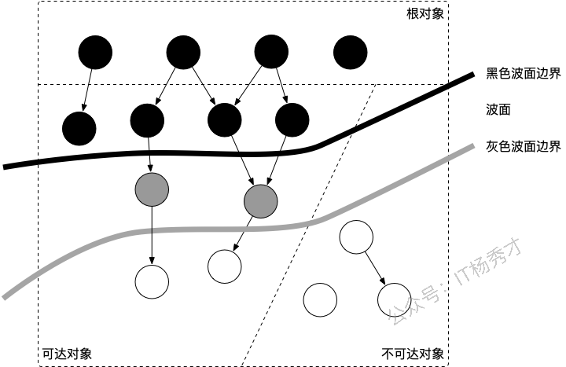

当垃圾回收开始时，只有白色对象。随着标记过程开始进行时，灰色对象开始出现 (着色)，这时候波面便开始扩大。当一个对象的所有子节点均完成扫描时，会被着色为黑色。当整个堆便利完成时，只剩下黑色和白色对象，这时的黑色对象为可达对象，即存活；而白色对象为不可达对象，即死亡。这个过程可以视为以灰色对象为波面，将黑色对象和白色对象分离，使波面不断向前推进，直到所有可达达灰色对象都变为黑色对象为止的过程

### 11.4 Go 语言中 GC 的根对象到底是什么？

根对象在垃圾回收的术语中又叫做根集合，它是垃圾回收器在标记过程时最先检查的对象，包括：

- 全局变量：程序在编译期就能确定的那些存在于程序整个生命周期的变量
- 执行栈：每个 goroutine 都包含自己的执行栈，这些执行栈上包含栈上的变量及指向分配的堆内存区块的指针
- 寄存器：寄存器的值可能表示一个指针，参与计算的这些指针可能指向某些赋值器分配的对内存区块

### 11.5 STW 是什么意思？

STW 是 Stop the World 的缩写，通常意义上指的是用户代码被完全停止运行，STW 越长，对用户代码造成的影响 (例如延迟) 就越大，早期 Go 对垃圾回收器的实现中 STW 长达几百毫秒，对时间敏感的实时通信等应用程序会造成巨大的影响

### 11.6 并发标记清除法的难点是什么？

并发标记清除法的核心难点在于如何保证在用户程序并发修改对象引用时，垃圾回收器仍能正确识别存活对象

主要难点：

- 对象消失问题：在标记过程中，如果用户程序删除了从黑色对象到白色对象的引用，同时从灰色对象到该白色对象的引用也被删除，这个白色对象就会被错误回收，但它实际上还是可达的
- 新对象处理：标记期间新分配的对象如何着色？如果标记为白色可能被误回收，标记为黑色可能造成浮动垃圾

### 11.9 Go 语言中 GC 的流程是什么？

| 阶段             | 说明                                                       | 赋值器状态 |
| ---------------- | ---------------------------------------------------------- | ---------- |
| SweepTermination | 清扫种植阶段，为下一个阶段的并发标记做准备工作，启动扫屏障 | STW        |
| Mark             | 扫描标记阶段，与赋值器并发执行，写屏障开启                 | 并发       |
| MarkTermination  | 标记终止阶段，保证一个周期内标记任务完成，停止写屏障       | STW        |
| GCoff            | 内存清扫阶段，将需要回收的内存归还到堆中，写屏障关闭       | 并发       |
| Gcoff            | 内存归还阶段，将过多的内存归还给操作系统，写屏障关闭       | 并发       |

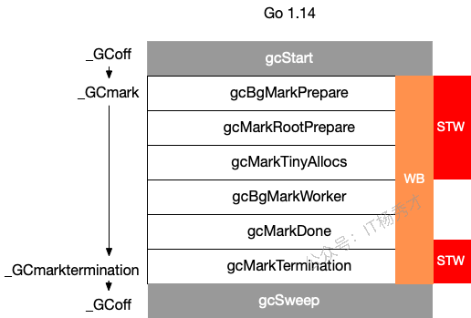

### 11.10 GC 触发的时机有哪些

- 主动触发，通过调用 runtime.GC() 触发 GC，此调用阻塞式地等待当前 GC 运行完毕
- 被动触发，分为两种方式：
  - Go 后台有一系统监控线程，当超过两分钟没有产生任何 GC 时，强制触发 GC
  - 内存使用增长一定比例时有可能会触发，每次内存分配时检查当前内存分配量是否已达到阈值 (环境变量 GOGC)：默认 100%，即当内存扩大一倍时启用 GC
    - 可以通过 debug.SetGCPercent(500) 来修改步调，这里表示，如果当前堆大小超过了上次标记的堆大小的 500%，就会触发
    - 第一次 GC 的触发的临界值是 4MB

### 11.11 GC 关注的指标有哪些

- CPU 利用率：回收算法会在多大程度上拖慢程序？有时候，这个是通过回收占用的 CPU 时间与其他 CPU 时间的百分比来描述的
- GC 停顿时间；回收器会造成多长时间的停顿？目前的 GC 中需要考虑 STW 和 Mark Assist 两个部分可能造成的停顿
- GC 停顿频率：回收器造成的停顿频率是怎样的？目前的 GC 中需要考虑 STW 和 Mark Assist 两个部分可能造成的停顿
- GC 可扩展性：当堆内存变大时，垃圾回收器的性能如何？但大部分的程序可能并不一定关心这个问题

### 11.12 有了 GC，为什么还会发生内存泄漏

有 GC 机制的话，内存泄漏其实就是预期的能很快被释放的内存，其生命期意外地被延长，导致预计能够立即回收的内存长时间得不到回收

Go 语言主要有以下两种：

- 内存被根对象引用而没有得到迅速释放，比如某个局部变量被复制到了一个全局变量 map 中
- goroutine 泄漏，一些不当的使用，导致 goroutine 不能正常退出，也会造成内存泄漏

### 11.13 Go 的 GC 如何调优

- 合理化内存分配的速度、提高赋值器的 CPU 利用率
- 降低并服用已经申请的内存，比如使用 sync.pool 服用经常需要创建的重复对象
- 调整 GOGC，可以适量将 GOGC 的值设置得更大，让 GC 触发的时间变得更晚，从而减少其触发频率，进而增加用户代码对机器的使用率
